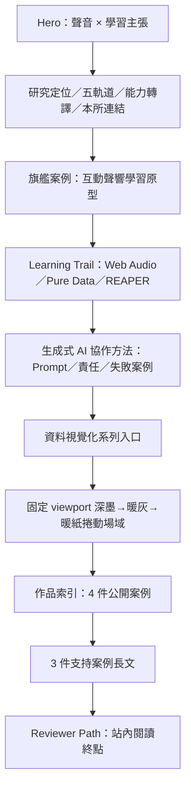

# 目前產品與資訊架構

## 2026-07-18 初代動態鑑識復原

- 依初代原始碼與錄影，只復原可驗證的 Hero 片語 line-mask stagger：片語由 `y:112%` 與交錯 `±3deg` 進場；研究介紹首幀保留部分 opacity，再收束到終態，因此 DOM 文字仍是 LCP 路徑。沒有恢復整頁 mount opacity／translate，也沒有新增證據不足的通用 section reveal 或卡片 opacity stagger。
- 深墨→暖紙繼續由 fixed full-viewport field 驅動，不退回 document-root 色彩插值；開始／結束點依實際 section 幾何計算，維持約 0.8–1.2 viewport 的可停留、可逆範圍。Hero canvas 已移除永久 `will-change`。
- `AnimatedDetails` 現在處理 `defaultOpen`、共用且可即時更新的 reduced-motion media query、開關反轉、ResizeObserver 高度 retarget、偏好在動畫中途切換時的立即完成，以及完成／unmount 後的 WAAPI cleanup。Lenis 也會隨 reduced-motion 執行期間變更即時建立或銷毀。
- 深層 fragment 定位改為 double-rAF layout settle 與最多兩次校正；wheel、touch、pointer 或 scroll key 會取消尚未完成的校正，避免長時間 rAF 迴圈與使用者捲動互相競爭。
- Rendered matrix 以 1440×900、2048×767、390×844 驗證：轉場範圍分別為 823 px／0.914 viewport、731 px／0.953 viewport、734 px／0.870 viewport；0／25／50／75／100% 前進與反向 opacity 一致，中段停止 320 ms 不漂移，三組皆無水平溢位。長逐字稿完成高度在 1440 px 為 1769 px、窄版為 2023 px，resize-during-open、六次快速反轉、Enter／Space、行動選單 Escape／focus restore 與 fresh console 0 warning／error 均通過。

## 2026-07-17 全畫面捲動漸變與折疊動畫修正

- 移除作品索引前原本佔據 layout 高度的靜態 linear-gradient bridge，改由 `ViewportThemeTransition` 提供 `position: fixed; inset: 0; pointer-events: none` 的完整 viewport 背景層。ScrollTrigger 以 `#data-visualization-series` 底部到達 viewport 85% 為起點、`#project-index-title` 到達 15% 為終點，連續 scrub 紙色、暖灰霧面與三個低對比 radial fields 的 opacity／transform；向上捲動可逆，停止時保留當前混色，不修改 document root 或文字色 tokens。
- Prompt Template、7 個圖解文字說明與中英長篇逐字稿統一使用 `AnimatedDetails`：保留 `
/
`、Enter／Space 與 `aria-expanded` 語意，展開 360 ms、收合 300 ms，收合完成前內容維持 mounted；箭頭、內容 opacity／位移與實際高度同步。完成後發出 `portfolio:layout-change`，集中更新 Lenis range 與 ScrollTrigger geometry。
- 行動版閱讀路徑選單沿用既有 Motion，新增同方向的高度／opacity 展開與收合；Escape、點擊外部、焦點還原及 `inert`／`aria-hidden` 狀態維持。Reduced motion 下轉場改為離散端點，所有折疊立即完成；print 隱藏背景場域並強制展開可讀內容。
- 本輪只改上述轉場與 disclosure feedback；當時的 Hero、R3F、卡片、Custom Cursor、聲響、配色、字型、導覽 IA、SEO 與響應式規則均未移除或重設，也沒有新增 dependency。Repository 沒有可確認的通用 section reveal 系統。
- Rendered regression：1440×900 的轉場範圍約 823 px（0.914 viewport），375×812 約 712 px（0.877 viewport）；兩者中段皆為全視窗暖灰場域、固定層四邊貼齊 viewport、0 horizontal overflow。長逐字稿在 375 px 由約 70 px 展開至 2056 px 再完整收回；滑鼠、快速反轉、Enter、Space 與行動選單 Escape 均通過，console warning／error 為 0。

## 2026-07-17 全站觀看體驗補強

- Hero 保留既有 R3F 與 CTA motion，使用完整語意的編輯式主標與受控 fluid type；2026-07-18 再加入初代可驗證的片語 line-mask stagger，研究介紹首幀仍部分可見。
- Navbar 現在提供目前區段的 active state／`aria-current`，主要導覽與閱讀路徑達 44 px；行動 Escape 還焦行為不變。
- 深層案例 hash 會在 `content-visibility` 與 Lenis range 重算後，以 double-rAF settle 與最多兩次校正完成定位；任何 wheel、touch、pointer 或 scroll-key 輸入都會取消未完成校正。
- 公開案例 `titleLines` 必須攤平後等於完整 `title`；Reading map 只連到實際存在的 supporting media section。

## 產品目的與受眾（已驗證）

網站的明文定位是 `Graduate Portfolio / Sound, Interaction & Learning`。作者從國立嘉義大學數位學習設計與管理、插畫、動畫與影像創作出發，正以 Pure Data、REAPER 與 Web Audio 探索跨感官學習回饋；目前可公開且可操作的核心證據是原生 Web Audio 原型。主要受眾是研究所審查者，主要成功行為是理解研究問題、操作旗艦原型、再檢視支援案例與學習路徑。來源：[`../../src/data/portfolio.js`](../../src/data/portfolio.js)。

## Repository 與交付狀態

- Canonical root 是 `C:\Users\911su\Documents\Codex\如願個人網站`。
- 目前 HEAD 為 `8c0c04d`，位於 `feat/portfolio-admission-foundation`；同名 `origin` branch 為 `12710dc`，本機 ahead 1／behind 0。`main`／`origin/main` 目前均為 `6b6e689`。
- 本輪開始時已有 17 個未提交修改檔（包含使用者先前更新的 `AGENTS.md` 與上一輪 AI MV 實作）；本輪在同一 working tree 上做增量修正，沒有 stage、stash、commit、push、merge 或 deploy。manual-only Pages workflow 已在 repository，但本任務沒有重新查詢 PR、遠端 run、Pages URL、custom domain 或 production field data。
- 應用、內容與文件已能形成完整本機 review flow；hidden-only assets、built construction wording、stale metadata、hidden 完整度假警告與 Three 超大 lazy chunk 的已知本機缺口已關閉，也已產生對應當前 source fingerprint 的 Lighthouse lab 證據。真實使用者研究、Hamlet 原始 Prompt log、權利審查、輔具／實機與 production hosting 仍未完成。

## 路由與導覽模型

- **實際 route：** 只有 `/`，client-rendered React SPA；未安裝 router。
- **導覽：** 固定膠囊列包含「研究定位、聲響原型、學習歷程、作品索引、支持證據、閱讀路徑」。桌面直接顯示；行動版由具 `aria-expanded`／`aria-controls` 的「閱讀路徑」按鈕開啟選單。
- **行動選單：** 高度、opacity 與輕微位移會在開啟／關閉時同步動畫；支援 Escape 關閉並把焦點還給 trigger，也支援點擊選單外關閉；選擇項目後焦點進入目標標題。
- **捲動：** 非 reduced-motion 環境優先由 Lenis 前往 anchor，offset -96px；一般 fallback 使用原生 smooth scroll，reduced-motion 使用 `auto`，且偏好在執行期間變更時會即時建立／銷毀 Lenis runtime。初始 deep link 會讓 fragment 所屬長案例完成 layout、重算 Lenis range，再以 double-rAF 與最多兩次校正定位；使用者開始 wheel、touch、pointer 或 scroll-key 操作時立即取消未完成校正，避免 `content-visibility` placeholder 與背景 settle 競爭輸入。導覽會以 `history.replaceState` 更新 hash；桌面鍵盤 Enter 與行動選單會把焦點移到目標標題，桌面滑鼠點擊仍保留焦點在連結。長頁保留可見的平台 scrollbar，它穩定使用 root 深色 tokens；320 px viewport 也不產生水平溢位。
- **主題：** document root 與前景 tokens 保持穩定；支持作品 gallery 與 Reviewer Path 沿用局部 `paper-surface` tokens。固定 viewport 場域在實際 section 邊界間 scrub 深墨→暖灰→暖紙，ScrollTrigger 只控制專用背景層與 fixed nav chrome，不修改 root 或內容文字 palette。
- **轉換終點：** `#reviewer-path` 明確說明「目前沒有公開聯絡資料」，只提供「回到聲響原型」與「閱讀作品索引」。沒有假聯絡 CTA。

## 實際頁面順序

旗艦案例在作品索引之前完整呈現；索引仍列出全部 4 件公開案例。`CaseStudyShowcase` 以 `scope="flagship"` 和 `scope="supporting"` 避免重複長文。來源：[`../../src/App.jsx`](../../src/App.jsx)、[`../../src/components/CaseStudyShowcase.jsx`](../../src/components/CaseStudyShowcase.jsx)。

## 區段清單

| Anchor | 目的與主要內容 | 行為／狀態 |
| --- | --- | --- |
| `#top` | 標題「讓視覺成為聲音的入口，讓聲音成為學習的回饋。」、背景、介紹、兩個 CTA | 完整語意與編輯式片語換行；片語以初代可驗證的 line-mask stagger 進場，介紹首幀部分可見；CTA 保留次要進場；R3F 在 DOM paint window 後延遲漸進載入 |
| `#research-positioning` | 研究命題、可信度、研究問題、證據鏈 | 已實作；由 `homepageNarrative` 驅動 |
| `#research-tracks` | 一條聲響主線與五個支援軌道 | 顯示軌道目的、能力與關聯案例數 |
| `#translation-map` | 把學習／媒體經驗轉成研究能力 | 靜態術語對照卡 |
| `#institute-alignment` | 由公開案例派生的 demonstrated 主題證據 | 目前列出 AI、互動媒體、聲響、跨域創生及其精確案例；「沉浸式體驗」與「數位孿生」因只是研究方向而不出現於摘要 |
| `#interactive-sound-learning` | 旗艦長篇案例 | 原型中；包含 lazy Web Audio demo、3 張圖解、工具、角色、未驗證狀態及計畫 |
| `#interactive-sound-learning-demo` | 可操作視聽映射 | 需使用者點擊啟用聲音；pointer pad 以具說明的圖像語意呈現，touch／4 個 range 提供實際操作；starting／unsupported／timeout fallback；一般停止有短 release，頁面隱藏／unmount 立即清理 |
| `#learning-trail` | 誠實呈現工具學習狀態 | Web Audio 有原型；Pure Data／REAPER 只有學習狀態，沒有偽造作品連結 |
| `#ai-workflow` | 生成式 AI 協作方法 | 低比重呈現 AI 協助、作者責任、Prompt v1／v2、兩個真實失敗案例與文件路徑；不宣稱自研 LLM |
| `#data-visualization-series` | 兩件資料視覺化作品的系列脈絡 | 系列封面、能力、反思、聲響延伸與兩張案例卡 |
| `#project-index` / `#gallery` | 4 件公開案例總覽 | 入口前無額外空白 bridge；固定 viewport 場域由上一深色區底部 85% scrub 至標題頂部 15%，內容沿用局部暖紙 tokens，nav chrome 依同一 progress 切換 |
| `#generative-interface-study` | AI 文學故事 MV | 原型中；40 秒／8 幕《Hamlet》成片、雙語字幕、實際 storyboard、具輸入／產出／控制／人工檢查的五階段流程、五層 story-to-video 敘事、派生的 Prompt Template v1、證據邊界與計畫中的形成性測試；尚無使用者結果 |
| `#data-visualization-cases` | 資料視覺化案例與數位學習應用 | 已完成分析影片；testing 狀態為 exploratory，不宣稱學習成效 |
| `#learning-dashboard-analysis` | Power BI 學習資料探索 | 原型中；實作日期 2026/06/11–06/12；概念圖公開，實際資料與結果隔離；不作因果宣稱 |
| `#reviewer-path` | 審查閱讀終點 | 兩個真實站內 CTA；沒有公開聯絡資料 |

`immersive-memory-map` 不在上表。它的完整文字位於 `portfolio.hidden.js`，並標記 `submissionVisibility: hidden`；內部施工備註另在 `portfolio.internal.js`。submission alias 解析到空模組，bundle 與公開 `portfolio.js` dev response 都不含案例 ID／文案。該案例現在使用空 media state；13 個 `ph-after-*`／`mv-soft-*` placeholder 已從 public 與 generator 移除，舊 canonical dev URL 為 404。治理完整度中的 diagrams／media 群組限定為 `submission-visible`，因此此 hidden 案例會標示「不適用」，不再產生假性待補警告。

## 案例共同結構

每件公開案例依序可包含：header／metadata、reading map 與證據快覽、draft notes（僅 draft）、問題、對象、證明、目標、可選互動原型、設計流程、技術、成果、擴充章節、圖解、媒體、工具／角色、testing、反思、研究所主題、credits、前後案例導覽。研究所主題會把已有作品證據與未來研究方向分組顯示，不把延伸想法偽裝成現有證據。結構化長頁案例可選用 workflow、Prompt decisions、可展開的 Prompt template、storyboard、media layers、deliverables、evidence boundary、outcomes、planned evaluation、next steps 與 CTA；Prompt template、圖解等價文字與雙語逐字稿共用 `AnimatedDetails` 的實際高度動畫與 native disclosure 語意，並支援 `defaultOpen`、快速反轉、ResizeObserver retarget、live reduced-motion 與 WAAPI cleanup。空資料區塊不渲染。旗艦 Web Audio 原型和部分大區段另有 error boundary；目前沒有 `tablist`／`tab`／`tabpanel` widget。

## 使用者可見狀態

- **載入：** Hero 3D 有純色 Suspense fallback；Web Audio prototype 有「互動聲響原型載入中。」；圖片使用 lazy loading，首張索引 cover eager。共用圖片 renderer 在檔案錯誤時保留固定媒體比例與可讀 fallback；本機影片另有 loading／ready／error 狀態。
- **音訊：** `尚未啟用`、`聲音啟用中`、`聲音播放中`、`聲音已停止`、`瀏覽器不支援`、`聲音啟用失敗`，透過 busy 區外的 atomic `role="status"`／polite live region 宣告；啟用中只把按鈕控制群組設為 `aria-busy`，停止／Escape／離屏／cleanup 均可取消 pending start。
- **錯誤：** Hero 的選配 3D scene 有局部 fallback，不會移除標題／介紹／CTA；旗艦案例、支持案例及聲響 demo 另有區段級 fallback；React 根也有可重新載入的全站 recovery boundary。影片錯誤會保留 Poster、直接 MP4 連結、Storyboard 與逐字稿，字幕錯誤會導向同頁雙語逐字稿。
- **測試：** 公開狀態分 `尚未驗證`、`探索中`、`已驗證`；目前沒有案例為 `validated`。
- **Restricted：** Power BI 只顯示不可公開原因；restricted item 不得含公開 href/src/embed URL。
- **Draft：** draft build 有黏性治理 banner、內容完整度、待補資料與風險；完整度會先判斷群組是否適用於 submission-visible 案例。submission 以 Vite alias 將整層替成空元件。
- **外部影片：** 一件資料視覺化案例使用 `youtube-nocookie.com` iframe；repo 沒有其他第三方 runtime service。
- **2026-07-18 motion-forensics 效能前後：** 直接修正前 archive `2026-07-17T16-21-04-610Z` 為 mobile Performance 94、LCP 2634 ms、TBT 75 ms、transfer 459090 B；desktop 100、LCP 555 ms、TBT 0 ms、transfer 442761 B。最終原始碼兩次 run 都維持 mobile 94、desktop 100；最新 archive `2026-07-17T17-31-33-225Z` 為 mobile LCP 2651 ms、TBT 90 ms、transfer 460502 B，desktop LCP 560 ms、TBT 0 ms、transfer 444173 B，另一 run 的波動上界為 mobile 2654／98 ms、desktop 602／38 ms。Accessibility 100、CLS 0；目前 submission build 為 initial JS 194195 gzip B、entry 160462 B、CSS 43286 B，lazy 3D closure 638680 raw／169383 gzip B。這是 localhost simulated lab，不是 production field data。
- **目前瀏覽器回歸：** submission preview 在 320×568、375×812、768×1024、1024×768、1440×900、1920×1080 皆為 0 global horizontal overflow、0 loaded broken image；83 個站內 hash links 為 0 broken target、0 duplicate ID。375×812 visible key targets 全部至少 44 px，行動 menu Escape 關閉並還焦；console warning／error 均為 0。

## 已確認的 submission 邊界

- Scanner core 可注入任意 output directory，CLI fail closed；36 個 fixtures 實際斷言 bad output exit 1、clean output exit 0，diagnostics 不回印敏感內容；VTT、Web Manifest 與 source map 也納入文字掃描。
- Fresh submission `dist/` 由 48 個 text rules 與 6 個 inventory rules 檢查，另保留不同方法的獨立文字搜尋與檔名盤點。
- `audit:evidence` 核對 Hamlet 三份直接交付檔的 bytes／SHA-256、60 份衍生圖像的 inventory SHA-256／實際 dimensions、16 個 WebVTT cues 與 63 個 public Hamlet files；`check:publication` 同時要求頂層核准、完整 applicant attestation、逐項 rights checks 與 evidence refs，目前正確地被擋下。
- Submission dev middleware 對 13 個舊 hidden media URL 與 `/dist/*` 回傳 404，避免 Vite SPA fallback 偽裝成 200；有效 public media 仍為 200。Filesystem deny 對 restricted media、internal／hidden modules 與歷史 report copy 回傳 403。
- `llms.txt`、favicon、social preview、index／JSON-LD 與案例 SEO title 使用 RU / YUAN，`llms.txt` 只列實際存在的 Navbar anchors。
- 內容 validator 與 submission gate 的通過不代表授權、使用者研究、screen reader、實機或 production hosting 已完整。

## 外部系統與缺席功能

沒有 CMS、API request、backend、database、authentication、storage、analytics、contact form、search、filter、modal、carousel 或獨立 404 route。已配置 manual-only GitHub Pages workflow、相對 base path 與 build audit；GitHub repository 與本機／`origin` refs 已確認，但本任務沒有重新查詢 PR、remote checks／workflow runs，也沒有正式部署、Pages URL 或 domain。
