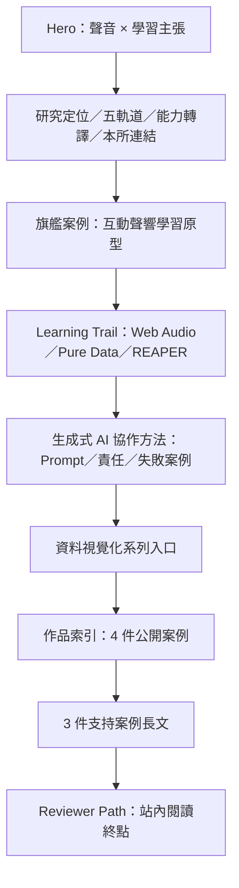

# 目前產品與資訊架構

## 產品目的與受眾（已驗證）

網站的明文定位是 `Graduate Portfolio / Sound, Interaction & Learning`。作者從國立嘉義大學數位學習設計與管理、插畫、動畫與影像創作出發，正以 Pure Data、REAPER 與 Web Audio 探索跨感官學習回饋；目前可公開且可操作的核心證據是原生 Web Audio 原型。主要受眾是研究所審查者，主要成功行為是理解研究問題、操作旗艦原型、再檢視支援案例與學習路徑。來源：[`../../src/data/portfolio.js`](../../src/data/portfolio.js)。

## 路由與導覽模型

- **實際 route：** 只有 `/`，client-rendered React SPA；未安裝 router。
- **導覽：** 固定膠囊列包含「研究定位、聲響原型、學習歷程、作品索引、支持證據、閱讀路徑」。桌面直接顯示；行動版由具 `aria-expanded`／`aria-controls` 的「閱讀路徑」按鈕開啟選單。
- **行動選單：** 支援 Escape 關閉並把焦點還給 trigger，也支援點擊選單外關閉；選擇項目後焦點進入目標標題。
- **捲動：** 非 reduced-motion 環境優先由 Lenis 前往 anchor，offset -96px；一般 fallback 使用原生 smooth scroll，reduced-motion 使用 `auto`。導覽會以 `history.replaceState` 更新 hash；桌面鍵盤 Enter 與行動選單會把焦點移到目標標題，桌面滑鼠點擊仍保留焦點在連結。長頁保留可見的平台 scrollbar，並以深色／暖紙 theme token 呈現；320 px viewport 也不產生水平溢位。
- **主題：** gallery 門檻前後只在深色／暖紙兩個合格端點間離散切換；不插值文字與背景色。navbar 與行動選單的無 `color-mix()` fallback 也跟隨 theme token。
- **轉換終點：** `#reviewer-path` 明確說明「目前沒有公開聯絡資料」，只提供「回到聲響原型」與「閱讀作品索引」。沒有假聯絡 CTA。

## 實際頁面順序

旗艦案例在作品索引之前完整呈現；索引仍列出全部 4 件公開案例。`CaseStudyShowcase` 以 `scope="flagship"` 和 `scope="supporting"` 避免重複長文。來源：[`../../src/App.jsx`](../../src/App.jsx)、[`../../src/components/CaseStudyShowcase.jsx`](../../src/components/CaseStudyShowcase.jsx)。

## 區段清單

| Anchor | 目的與主要內容 | 行為／狀態 |
| --- | --- | --- |
| `#top` | 標題「讓視覺成為聲音的入口，讓聲音成為學習的回饋。」、背景、介紹、兩個 CTA | 標題／介紹首幀可見；CTA 保留次要進場；R3F 在 DOM paint window 後延遲漸進載入 |
| `#research-positioning` | 研究命題、可信度、研究問題、證據鏈 | 已實作；由 `homepageNarrative` 驅動 |
| `#research-tracks` | 一條聲響主線與五個支援軌道 | 顯示軌道目的、能力與關聯案例數 |
| `#translation-map` | 把學習／媒體經驗轉成研究能力 | 靜態術語對照卡 |
| `#institute-alignment` | 六個研究主題與證據優先規則 | 靜態策展說明 |
| `#interactive-sound-learning` | 旗艦長篇案例 | 原型中；包含 lazy Web Audio demo、3 張圖解、工具、角色、未驗證狀態及計畫 |
| `#interactive-sound-learning-demo` | 可操作視聽映射 | 需使用者點擊啟用聲音；pointer pad 以具說明的圖像語意呈現，touch／4 個 range 提供實際操作；starting／unsupported／timeout fallback；一般停止有短 release，頁面隱藏／unmount 立即清理 |
| `#learning-trail` | 誠實呈現工具學習狀態 | Web Audio 有原型；Pure Data／REAPER 只有學習狀態，沒有偽造作品連結 |
| `#ai-workflow` | 生成式 AI 協作方法 | 低比重呈現 AI 協助、作者責任、Prompt v1／v2、兩個真實失敗案例與文件路徑；不宣稱自研 LLM |
| `#data-visualization-series` | 兩件資料視覺化作品的系列脈絡 | 系列封面、能力、反思、聲響延伸與兩張案例卡 |
| `#project-index` / `#gallery` | 4 件公開案例總覽 | 案例卡顯示來源、狀態、證明、roles、tools、研究主題；也是 scroll theme inversion trigger |
| `#generative-interface-study` | 生成式 AI 介面研究 | 研究構想；有流程圖，無公開 prototype／媒體，未驗證 |
| `#data-visualization-cases` | 資料視覺化案例與數位學習應用 | 已完成分析影片；testing 狀態為 exploratory，不宣稱學習成效 |
| `#learning-dashboard-analysis` | Power BI 學習資料探索 | 原型中；年份省略、概念圖公開、restricted 截圖隔離、不作因果宣稱 |
| `#reviewer-path` | 審查閱讀終點 | 兩個真實站內 CTA；沒有公開聯絡資料 |

`immersive-memory-map` 不在上表，因它只在 draft 資料中存在且 `submissionVisibility: hidden`，正式 build 不包含該資料。 

## 案例共同結構

每件公開案例依序可包含：header／metadata、reading map 與證據快覽、draft notes（僅 draft）、問題、對象、證明、目標、可選互動原型、設計流程、技術、成果、擴充章節、圖解、媒體、工具／角色、testing、反思、研究所主題、credits、前後案例導覽。空資料區塊不渲染。旗艦 Web Audio 原型和部分大區段另有 error boundary。

## 使用者可見狀態

- **載入：** Hero 3D 有純色 Suspense fallback；Web Audio prototype 有「互動聲響原型載入中。」；圖片使用 lazy loading，首張索引 cover eager。
- **音訊：** `尚未啟用`、`聲音啟用中`、`聲音播放中`、`聲音已停止`、`瀏覽器不支援`、`聲音啟用失敗`，透過 busy 區外的 atomic `role="status"`／polite live region 宣告；啟用中只把按鈕控制群組設為 `aria-busy`，停止／Escape／離屏／cleanup 均可取消 pending start。
- **錯誤：** Hero 的選配 3D scene 有局部 fallback，不會移除標題／介紹／CTA；旗艦案例、支持案例及聲響 demo 另有區段級 fallback；React 根也有可重新載入的全站 recovery boundary。
- **測試：** 公開狀態分 `尚未驗證`、`探索中`、`已驗證`；目前沒有案例為 `validated`。
- **Restricted：** Power BI 只顯示不可公開原因；restricted item 不得含公開 href/src/embed URL。
- **Draft：** draft build 有黏性治理 banner、內容完整度、待補資料與風險；submission 以 Vite alias 將整層替成空元件。
- **外部影片：** 一件資料視覺化案例使用 `youtube-nocookie.com` iframe；repo 沒有其他第三方 runtime service。
- **本機效能：** submission Lighthouse 對 immutable artifact 執行 mobile／desktop profiles，封存 raw JSON／CLI transcript／history、完整受測 `dist`、逐檔 artifact／source manifests、completion marker 與 profile／environment fingerprints；最新同 artifact／source content／profile 三次 mobile 為 Performance 96–97、LCP 2.258–2.407 s、TBT 23–34 ms，desktop 為 Performance 100、LCP 0.504–0.505 s、TBT 0，LCP node 皆是 Hero 標題。這些是 localhost simulated lab 結果，不代表正式 hosting field data。

## 外部系統與缺席功能

沒有 CMS、API request、backend、database、authentication、storage、analytics、contact form、search、filter、modal、carousel 或獨立 404 route。已配置 manual-only GitHub Pages workflow、相對 base path 與 build audit；GitHub repository、working branch 與 Draft PR #1 已確認，但目前沒有 connector 可見的 remote checks／workflow runs，也沒有正式部署、Pages URL 或 domain。
