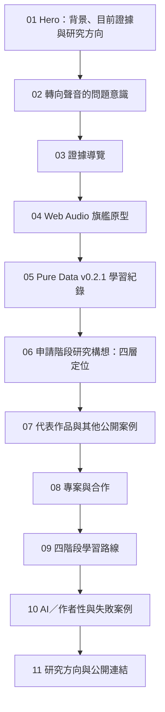

# 目前產品與資訊架構

## 2026-07-26 rights 與公開展示版整合

- Hamlet 播放器後方新增 compact「素材來源與公開範圍」面板，使用既有 `evidence-panel`／`soft-panel`；沒有新增 Navbar、主 IA anchor 或大型 section。
- 面板列出 ChatGPT／OpenAI 場景圖、William Shakespeare 文學基礎、申請者與 ChatGPT 的改寫核對分工、Suno 音樂／歌詞／人聲、Canva editing/export-only 角色、非營利公開範圍及 confirmed attestation。
- 公開 copy 保留原始 instrumental／no lyrics 提示方向，同時明確更正實際聲軌含英語歌詞與人聲；WebVTT 是故事字幕，不是歌曲逐字歌詞字幕。
- Rights schema 與 Pages gate 已接入；蕭智仁於 2026-07-26 完成 applicant attestation。最新整合 manifest 為 `verified / approved`，targeted publication audit exit 0；核准範圍維持 limited-use／非營利，且不改變 Hamlet `notValidated`。
- Admission data 現分為 public narrative 與 `admission-evidence.audit.js`。公開區段只渲染作品、方法、角色與下一步；Draft／Audit 以 stable ID 保存完整 evidence／validation／rights／limitations／requests。Submission module graph 不讀 audit records，但 public Repository 內的 source 仍應視為公開。
- 《畫本》與指定 MV 已有經確認的 canonical YouTube 作品入口，公開卡片改為作品摘要、角色、工具、重點、反思及一段必要素材說明；Pure Data 公開頁保留功能測試、觀看指南、AI 協作學習與簡短版本說明，詳細限制留在 audit。
- `DataVisualizationSeries` 使用不透明深色閱讀面，mist／paper 動畫留在周圍背景；`useThemeInversion` 以 central endpoint 同步 navigation 與 field。`App` 的 `ResizeObserver` 在 lazy 內容改變高度時重新校正 deep links。
- 最新整合已完成 install／`doctor` exit 0、sound 18/18、rights 14/14、scanner 73/73；submission scan 為 132 files／25 text files、67 text rules／9 inventory rules，118 個 public files 為 0 missing／0 SHA-256 mismatch，`check:publication` exit 0／`verified / approved`。
- Browser 在 1280×800、768×900、390×844、320×720 為 0 overflow、0 broken hashes、0 duplicate IDs、0 broken images與console 0 warning／0 error；四個代表性 deep links 約 95–112 px，dark／paper endpoints與行動 menu Escape／還焦通過。
- 原始生成紀錄、原始 EML 與可編輯 Canva 專案仍未找到；screen reader、真實 200% zoom、system reduced-motion、實機與多瀏覽器音訊未驗。Rights approval 不等於 private originals、第三方 YouTube 完整 rights／credit 或學習成效已獨立查驗，Draft PR 也不等於發布核准。

## 整合後 source 模型

- `App.jsx` 現在呈現 11 個主要閱讀段落：Hero、轉向聲音的問題意識、證據導覽、Web Audio 旗艦原型、Pure Data 學習紀錄、申請階段研究構想、代表作品與其他公開案例、專案與合作、學習路線、AI／作者性、研究方向與連結。資料視覺化系列及支持案例索引屬代表作品段落的延伸閱讀。
- [`../../src/data/admission-evidence.js`](../../src/data/admission-evidence.js) 保存 Pure Data、兩件代表作品、合作事件、四階段學習路線與外部連結的 public narrative；[`../../src/data/admission-evidence.audit.js`](../../src/data/admission-evidence.audit.js) 以 stable ID 保存完整 audit records，並只由 Draft-only panel 透過 dynamic `import()` 載入。[`../../src/components/AdmissionEvidenceSections.jsx`](../../src/components/AdmissionEvidenceSections.jsx) 的單一 dynamic import 只依賴 public module，提供 Pure Data、代表作品、secondary creation、合作、學習路線與聯絡 6 個 lazy exports；研究構想與 AI／作者性各有獨立 lazy chunk。各段仍具永久 section wrapper、錯誤隔離與 fragment 重新校正。
- Pure Data 不再只是「沒有 artifact」的學習狀態。公開頁已整合 v0.2.1 約 63 秒本機功能測試影片與 1276×720 poster，呈現四組參數映射、Preset、Reset、Panic 與輸出監看；狀態仍是 `學習中／可操作功能原型`、`尚待驗證`，初版 Patch 並非申請者獨立完成。
- Pure Data 影片與 poster 位於 `public/media/portfolio/`，因此會被 Vite 原樣複製。兩者畫面仍可見本機 D 槽專案路徑與 `validated` 字樣；頁面雖統一改稱「本機功能測試」，但 binary 畫面中的風險仍然存在，不能寫成已清理或已取得研究驗證。
- 《畫本》與《希望有羽毛和翅膀》MV 混剪已加入精簡 public narrative 與經確認的 canonical YouTube 作品入口。前者只主張故事構思、攝影、剪輯及申請者提供的參賽情境；後者明列為非商業二次創作，只主張選曲、素材研究、取材、篩選與剪輯。公開連結不等於得獎、觀看成效或第三方素材所有權，完整 credit、活動／課程紀錄、來源與權利 artifact 仍留在 audit 缺口。
- REAPER 在公開 roadmap 中已修正為「下一階段」，不再以「正在學習／已安裝」暗示已有操作證據；目前仍沒有公開工程、routing、混音成果或聲音輸出。
- 混合監聽研究構想由四層資料驅動：`1. 問題`、`2. 初步構想`、`3. 申請者可帶入的能力`、`4. 入學後需補強`；另列五步預定流程、預期貢獻與申請階段聲明。完整研究計畫仍在非公開工作區，頁面沒有下載連結。
- 公開／私有界線以實際檔案位置判斷：`public/` 的 Pd 影片／poster、admission public／audit source 與 `docs/admission/*` 都屬 public Repository 可讀範圍；`.pd` 原檔、完整研究計畫、REAPER 工程與 private originals 未放入公開 repository。兩件代表作品以外部 canonical URL 連出，不把第三方影片複製進 `public/`。Submission alias 只能隔離 bundle，不能保護 public repository 中的 tracked source 或文件。
- `index.html` metadata、canonical URL、JSON-LD、`llms.txt`、favicon 與 social preview 已完成同步，不再列為本輪未決缺口。
- 最新 draft build 為 471 modules、entry 180733 B、CSS 44315 B、initial JS gzip 200889 B；submission build 為 467 modules、entry 153704 B、CSS 44315 B、initial JS gzip 192936 B。
- `check:publication` 已對整合後 source exit 0 並回報 `verified / approved`；production workflow 仍會在 configure／upload 前重新執行 submission 與 publication gates。
- Print 現在會把 `.theme-reading-surface`／dark variant 重設為可讀紙色 tokens、移除 overflow 與 shadow；這是 print reading contract，不代表真實印表機／PDF 輸出已人工驗收。
- Pages run `30087568225` 是 PR #6 的歷史部署證據；目前 Draft PR 尚未部署，不能由本機 gates 推論 production HTTP、field 狀態或發布核准。

## 2026-07-24 Admission Evidence Pass（整合前歷史快照）

- 首屏已改為國立臺南藝術大學 116 學年度申請語境，明確交代蕭智仁、2026 年國立嘉義大學數位學習設計與管理學系畢業，以及由視覺敘事／資訊架構／互動介面走向聲音的路徑。
- 首頁研究主張已從 Web Audio 個案問題收斂為「精簡揚聲器＋開放式耳機混合多聲道監聽與視覺化校準」的申請階段研究構想。Web Audio 原來的視聽映射研究問題保留在旗艦個案內，不再冒充完整研究計畫。
- 實際 Reviewer Path 改為：研究定位 → Web Audio 證據 → Pure Data／REAPER 學習軌跡 → 代表作品 → 研究構想 → AI／作者性 → 站內送審閱讀出口。原本在旗艦前的研究軌道／能力轉譯／系所證據摘要已後置；AI 也移到代表作品與研究構想之後。
- Web Audio 公開 signal flow 已補齊「使用者輸入 → 數值正規化 → 聲音參數映射 → Oscillator → Filter → Gain／Envelope → Stereo Panner → Compressor → Master Output」，並新增可證明／作者與 AI 分工／不能證明三組邊界。
- Learning Trail 現在使用一致狀態：Web Audio `可操作原型／尚待驗證`；Pure Data `學習中`、開始日期 `2026/07/24` 且明示 AI 協作與逆向拆解；REAPER `學習中`、已安裝但尚未開始系統性練習。
- Repository 與歷史中沒有《畫本》、MV 混剪、`.pd`、`.rpp` 或可歸屬聲音輸出，因此本輪沒有生成或推測這些案例。需求與建議檔名已移至 `docs/admission/EVIDENCE_REQUESTS.md`。
- 新增 `docs/admission/{ADMISSION_EVIDENCE_SUMMARY,EVIDENCE_REQUESTS,PUBLICATION_BOUNDARY_AUDIT}.md`。Public Repository、tracked hidden／internal／prompts、Vite `public/` 全量複製與 Hamlet rights gate 的差異均已明文記錄。
- 本輪不改 Hero R3F、GSAP／Lenis、scroll transition、custom cursor、Web Audio lifecycle、reduced-motion、focus、submission alias、Pages base path 或媒體檔；也沒有 commit、push、PR 或 deploy。
- 當時 `pnpm run doctor` exit 0；舊 scanner、build、bundle 與 inventory 數字已由上方最新結果取代。
- 當時的 `dist/` 獨立比對為 116 個 public files 0 missing／0 SHA-256 mismatch；PR #7 基線後來記錄 118-file inventory。當時 `check:publication` 預期 exit 1，明列 11 個 Hamlet rights／attestation blockers；該 blocker 狀態已由 PR #7 limited-use attestation／publication gate 基線取代。
- 當時 1440×900 與 375×812 browser regression 曾記錄通過；它早於目前 IA 與 AdmissionEvidence 整合，不是最新 Browser 結果。

## 2026-07-23 公開文案與交付快照

- 公開內容已改為自然的繁體中文第一人稱，直接交代「我做了什麼、目前有哪些材料、還不能證明什麼」。首頁現在以 `研究所作品集／聲響、互動與學習` 定位；介紹明確寫出作者在國立嘉義大學學習數位學習設計與管理、做過插畫／動畫／影像，且目前用 Web Audio 製作聲響互動原型。這次改寫沒有移除既有 R3F、Hero line-mask、Lenis、ScrollTrigger、disclosure、custom cursor 或聲響互動。
- GitHub PR #5 `caption adjust` 已於 2026-07-19 merged。Canonical 本機分支仍為 `codex/public-copy-rewrite`（`61ea9d8`），`main`／`origin/main` 為 squash 後的 `695b520`；兩個 refs 的檔案樹相同（`git diff --quiet main HEAD` exit 0），但 commit lineage 不同。
- `main` 的最新 Pages run `29680534295` 成功；production 首頁、當前 JS bundle、Hamlet MP4、英文與繁中 VTT、poster 於 2026-07-23 皆實測 HTTP 200。正式 bundle 已包含「現在我用 Web Audio 做聲響互動原型」與「AI 協助整理與檢查」，不再包含舊介紹中的「正透過 Pure Data」。
- 2026-07-23 `pnpm install --frozen-lockfile` 與 `pnpm run doctor` 均 exit 0。Fresh draft／submission build 的 initial JS gzip 分別為 199833 B／193737 B；entry 分別為 181592 B／160908 B；CSS 均為 43688 B。Lazy 3D closure 仍為 638680 raw／169383 gzip B。
- 當時 `pnpm run check:publication` 按設計 exit 1，共回報 11 個 Hamlet 權利／applicant attestation／evidence refs blockers；該 blocker 狀態已由 PR #7 limited-use attestation／publication gate 基線取代。**成功部署與資產可達只證明網站已公開，不代表超出核准範圍的權利、private originals 或研究成效。**

## 2026-07-18 初代動態鑑識復原

- 依初代原始碼與錄影，只復原可驗證的 Hero 片語 line-mask stagger：片語由 `y:112%` 與交錯 `±3deg` 進場；研究介紹首幀保留部分 opacity，再收束到終態，因此 DOM 文字仍是 LCP 路徑。沒有恢復整頁 mount opacity／translate，也沒有新增證據不足的通用 section reveal 或卡片 opacity stagger。
- 深墨→暖紙繼續由 fixed full-viewport field 驅動，不退回 document-root 色彩插值；開始／結束點依實際 section 幾何計算，維持約 0.8–1.2 viewport 的可停留、可逆範圍。Hero canvas 已移除永久 `will-change`。
- `AnimatedDetails` 現在處理 `defaultOpen`、共用且可即時更新的 reduced-motion media query、開關反轉、ResizeObserver 高度 retarget、偏好在動畫中途切換時的立即完成，以及完成／unmount 後的 WAAPI cleanup。Lenis 也會隨 reduced-motion 執行期間變更即時建立或銷毀。
- 深層 fragment 定位改為 double-rAF layout settle 與最多兩次校正；wheel、touch、pointer 或 scroll key 會取消尚未完成的校正，避免長時間 rAF 迴圈與使用者捲動互相競爭。
- Rendered matrix 以 1440×900、2048×767、390×844 驗證：轉場範圍分別為 823 px／0.914 viewport、731 px／0.953 viewport、734 px／0.870 viewport；0／25／50／75／100% 前進與反向 opacity 一致，中段停止 320 ms 不漂移，三組皆無水平溢位。長逐字稿完成高度在 1440 px 為 1769 px、窄版為 2023 px，resize-during-open、六次快速反轉、Enter／Space、行動選單 Escape／focus restore 與 fresh console 0 warning／error 均通過。

## 2026-07-17 全畫面捲動漸變與折疊動畫修正

- 移除作品索引前原本佔據 layout 高度的靜態 linear-gradient bridge，改由 `ViewportThemeTransition` 提供 `position: fixed; inset: 0; pointer-events: none` 的完整 viewport 背景層。ScrollTrigger 的自然邊界以 `#data-visualization-series` 底部到達 viewport 70% 與 `#project-index-title` 到達 25% 計算，再把 range clamp 為 0.8–1.2 viewport；期間連續 scrub 紙色、暖灰霧面與三個低對比 radial fields 的 opacity／transform。向上捲動可逆，停止時保留當前混色，不修改 document root 或文字色 tokens。
- Prompt Template、7 個圖解文字說明與中英長篇逐字稿統一使用 `AnimatedDetails`：保留 `
/
`、Enter／Space 與 `aria-expanded` 語意，展開 360 ms、收合 300 ms，收合完成前內容維持 mounted；箭頭、內容 opacity／位移與實際高度同步。完成後發出 `portfolio:layout-change`，集中更新 Lenis range 與 ScrollTrigger geometry。
- 行動版閱讀路徑選單沿用既有 Motion，新增同方向的高度／opacity 展開與收合；Escape、點擊外部、焦點還原及 `inert`／`aria-hidden` 狀態維持。Reduced motion 下轉場改為離散端點，所有折疊立即完成；print 隱藏背景場域並強制展開可讀內容。
- 本輪只改上述轉場與 disclosure feedback；當時的 Hero、R3F、卡片、Custom Cursor、聲響、配色、字型、導覽 IA、SEO 與響應式規則均未移除或重設，也沒有新增 dependency。Repository 沒有可確認的通用 section reveal 系統。
- Rendered regression：1440×900 的轉場範圍約 823 px（0.914 viewport），375×812 約 712 px（0.877 viewport）；兩者中段皆為全視窗暖灰場域、固定層四邊貼齊 viewport、0 horizontal overflow。長逐字稿在 375 px 由約 70 px 展開至 2056 px 再完整收回；滑鼠、快速反轉、Enter、Space 與行動選單 Escape 均通過，console warning／error 為 0。

## 2026-07-17 全站觀看體驗補強

- Hero 保留既有 R3F 與 CTA motion，使用完整語意的編輯式主標與受控 fluid type；2026-07-18 再加入初代可驗證的片語 line-mask stagger，研究介紹首幀仍部分可見。
- Navbar 現在提供目前區段的 active state／`aria-current`，主要導覽與閱讀路徑達 44 px；行動 Escape 還焦行為不變。
- 深層案例 hash 會在 `content-visibility` 與 Lenis range 重算後，以 double-rAF settle 與最多兩次校正完成定位；任何 wheel、touch、pointer 或 scroll-key 輸入都會取消未完成校正。
- 公開案例 `titleLines` 必須攤平後等於完整 `title`；Reading map 只連到實際存在的 supporting media section。

## 產品目的與受眾（已驗證）

公開頁的明文定位是「116學年度研究所申請作品集」，沒有在目前 user-facing source 寫出特定申請學校。作者以第一人稱說明自己是蕭智仁，現就讀國立嘉義大學數位學習設計與管理學系並預計 2026 年畢業，由視覺敘事、資訊架構與互動介面走向聲音。使用者另指定國立臺南藝術大學為目標語境，但正式系所名稱、簡章、時程與格式尚未由 current official source 核對，屬待 stakeholder 確認。主要受眾先理解轉向聲音的問題，再操作 Web Audio、觀看 Pure Data 本機功能紀錄、區分研究構想與已完成能力，最後查閱代表作品、合作事件、學習路線與作者性。來源：[`../../src/data/portfolio.js`](../../src/data/portfolio.js)、[`../../src/data/admission-evidence.js`](../../src/data/admission-evidence.js)、[`../../src/data/admission-research.js`](../../src/data/admission-research.js)。

## Repository 與交付狀態

- Canonical root 是 `C:\Users\911su\Documents\Codex\如願個人網站`。
- PR #1 至 #7 均已 merged；本輪 Draft PR #9 從最新 `main` 整合公開展示版與 PR #7 limited-use rights／attestation 基線，GitHub 回報 mergeable，且自動與 Browser 驗證均通過。PR #8 保持原衝突狀態；Draft PR 仍不是 merge、deploy 或 production publication approval。
- `.github/workflows/deploy-pages.yml` 會在 push 到 `main` 或 `workflow_dispatch` 時執行，並在 configure／upload 前依序要求 `check:submission` 與 `check:publication`。PR #6 的 run `30087568225`、build job `89463242126`、deploy job `89463660241` 是較早成功部署；它不包含 PR #7 rights 更新或本次公開展示版組合。
- Repository 沒有 `CNAME`，也沒有 production field-performance、輔具或實機證據。本輪不把未重新核對的 Pages API／HTTP 狀態寫成 current production。
- 應用、內容與文件已形成完整本機 review flow；hidden-only assets、built construction wording、stale metadata、hidden 完整度假警告與 Three 超大 lazy chunk 的既有缺口已關閉。2026-07-17／07-18 Lighthouse 只能視為歷史效能快照。真實使用者研究、Hamlet private originals、輔具／實機與 current production field evidence 仍未完成。
- **Rights gate 與研究狀態分開：** Hamlet manifest 對最新整合 source 為 `verified / approved`，蕭智仁已於 2026-07-26 完成具名 limited-use attestation，`check:publication` exit 0。這不會把 `notValidated`、private-original 缺口、第三方 YouTube 完整 rights／credit 或形成性研究升格為成功。

## 路由與導覽模型

- **實際 route：** 只有 `/`，client-rendered React SPA；未安裝 router。
- **導覽：** 固定膠囊列目前包含「問題意識、Web Audio、Pure Data、研究構想、代表作品、學習路線」，分別指向 `#sound-transition`、`#interactive-sound-learning`、`#pure-data-learning`、`#research-positioning`、`#selected-work`、`#learning-roadmap`。桌面直接顯示；行動版由具 `aria-expanded`／`aria-controls` 的「閱讀選單」按鈕開啟同一組項目。
- **行動選單：** 高度、opacity 與輕微位移會在開啟／關閉時同步動畫；支援 Escape 關閉並把焦點還給 trigger，也支援點擊選單外關閉；選擇項目後焦點進入目標 heading，lazy 區段則進入永久 section wrapper。
- **捲動：** 非 reduced-motion 環境優先由 Lenis 前往 anchor，offset -96px；一般 fallback 使用原生 smooth scroll，reduced-motion 使用 `auto`，且偏好在執行期間變更時會即時建立／銷毀 Lenis runtime。初始 deep link 會讓 fragment 所屬長案例完成 layout、重算 Lenis range，再以 double-rAF 與最多兩次校正定位；`ResizeObserver` 監看 `#main-content`，lazy section／媒體改變高度時可重新排程受限次數的 settle。使用者開始 wheel、touch、pointer 或 scroll-key 操作時立即取消未完成校正，避免 `content-visibility` placeholder 與背景 settle 競爭輸入。導覽會以 `history.replaceState` 更新 hash；桌面鍵盤 Enter 與行動選單會把焦點移到目標 heading 或 lazy 區段的永久 wrapper，桌面滑鼠點擊仍保留焦點在連結。長頁保留可見的平台 scrollbar。
- **主題：** document root 與前景 tokens 保持穩定；支持作品 gallery、研究構想、補充研究脈絡、AI／作者性與頁尾快速導覽沿用局部 `paper-surface` tokens。資料視覺化內容另使用不透明 `.theme-reading-surface--dark`，避免深色文字直接落在 mist／paper 中間幀。固定 viewport 場域在實際 section 邊界間 scrub 深墨→暖灰→暖紙；`useThemeInversion` 以 central endpoint 同步 field、navigation 與 reduced-motion callbacks，不修改內容文字 palette。
- **證據導覽與終點：** `#reviewer-path` 現位於旗艦證據之前，以六張卡分流至 Web Audio、Pure Data、代表作品、研究構想、學習路線與 AI／作者性；它不再是頁尾出口。真正收束點是 `#contact`，只提供已知的 GitHub Pages 與 GitHub Repository 外部連結；仍沒有 email、履歷、研究計畫下載或未確認的個人聯絡資料。

## 實際頁面順序

```mermaid
flowchart TD
  A["01 Hero：背景、目前證據與研究方向"] --> B["02 轉向聲音的問題意識"]
  B --> C["03 證據導覽"]
  C --> D["04 Web Audio 旗艦原型"]
  D --> E["05 Pure Data v0.2.1 學習紀錄"]
  E --> F["06 申請階段研究構想：四層定位"]
  F --> G["07 代表作品與其他公開案例"]
  G --> H["08 專案與合作"]
  H --> I["09 四階段學習路線"]
  I --> J["10 AI／作者性與失敗案例"]
  J --> K["11 研究方向與公開連結"]
```

旗艦案例在代表作品之前完整呈現。第 7 段先顯示《畫本》，再以資料視覺化系列入口與 `CaseStudyShowcase scope="supporting"` 延伸至既有公開案例，最後由 `#secondary-creation` 顯示指定 MV 混剪；這些巢狀 anchors 不另計為主要 IA 段落。來源：[`../../src/App.jsx`](../../src/App.jsx)、[`../../src/components/AdmissionEvidenceSections.jsx`](../../src/components/AdmissionEvidenceSections.jsx)、[`../../src/components/CaseStudyShowcase.jsx`](../../src/components/CaseStudyShowcase.jsx)。

## 區段清單

| Anchor | 目的與主要內容 | 行為／狀態 |
| --- | --- | --- |
| `#top` | Hero：申請語境、背景、目前最強證據與研究方向 | 完整語意與編輯式片語換行；R3F 在 DOM paint window 後漸進載入；CTA 指向 Web Audio demo 與 `#learning-roadmap` |
| `#sound-transition` | 轉向聲音的問題意識 | 以「開始注意／遇到門檻／帶入方法」三步把聆聽經驗連到數位學習、視覺敘事與資訊架構方法 |
| `#reviewer-path` | 證據導覽 | 六張站內卡依證據目的分流；Web Audio 是最強可操作證據，Pure Data 是學習紀錄，代表作品、研究、學習路線與 AI 各自閱讀 |
| `#interactive-sound-learning` | Web Audio 旗艦長篇案例 | `可操作原型／尚待驗證`；包含 lazy demo、9 階段 signal flow、四組 mapping、證據／作者與 AI 分工／不能證明邊界及計畫中的形成性測試 |
| `#pure-data-learning` | Pure Data v0.2.1 學習紀錄 | 公開 62.983 秒 H.264／AAC 本機功能測試與 1276×720 poster、五點觀看指南、可證明／不能證明／AI 協作／下一步；原始畫面仍暴露本機路徑與 `validated` |
| `#research-positioning`（alias `#research-proposal`） | 申請階段混合監聽研究構想 | 依問題、初步構想、可帶入能力、入學後需補強四層呈現；五步流程是預定方法，不是已執行實驗；完整研究計畫不公開 |
| `#selected-work` | 代表作品與其他公開案例 | 先以文字呈現《畫本》，再連到可核對的 Hamlet／資料案例，最後呈現《希望有羽毛和翅膀》MV 混剪的二次創作與權利邊界；`#data-visualization-series`、`#project-index`／`#gallery` 及三件支持案例是此段延伸 |
| `#collaboration` | 專案與合作 | 用社團重整、工作調整與畢業專題角色協調支持系統化、韌性與溝通，不取代聲音技術證據 |
| `#learning-roadmap` | 四階段學習路線 | 分成「已有可核對證據／正在學習／尚未形成作品／研究所階段」；REAPER、空間聲音與量測不冒充成果 |
| `#ai-workflow` | AI／作者性 | 三組責任、Prompt 版本與三個失敗鏈；不宣稱訓練或部署自研 LLM，也不把 AI 產生的 Patch 完整度當成獨立能力 |
| `#contact` | 研究方向與公開連結 | 收束目前證據、待補能力與混合監聽方向；只連到現有 Pages 與 public GitHub Repository，明示完整研究計畫留在非公開工作區 |

整合前文件列出的 `#learning-trail`、`#research-tracks`、`#translation-map` 與 `#institute-alignment` 已不在目前 `App.jsx` 的渲染順序；其資料或未掛載元件仍可能保留於 source，不能把舊 anchor 當成目前可達 IA。

`immersive-memory-map` 不在上表。它的完整文字位於 `portfolio.hidden.js`，並標記 `submissionVisibility: hidden`；內部施工備註另在 `portfolio.internal.js`。submission alias 解析到空模組，bundle 與公開 `portfolio.js` dev response 都不含案例 ID／文案。該案例現在使用空 media state；13 個 `ph-after-*`／`mv-soft-*` placeholder 已從 public 與 generator 移除，舊 canonical dev URL 為 404。治理完整度中的 diagrams／media 群組限定為 `submission-visible`，因此此 hidden 案例會標示「不適用」，不再產生假性待補警告。

## 案例共同結構

每件公開案例依序可包含：header／metadata、reading map 與證據快覽、draft notes（僅 draft）、問題、對象、證明、目標、可選互動原型、設計流程、技術、成果、擴充章節、圖解、媒體、工具／角色、testing、反思、研究所主題、credits、前後案例導覽。研究所主題會把已有作品證據與未來研究方向分組顯示，不把延伸想法偽裝成現有證據。結構化長頁案例可選用 workflow、Prompt decisions、可展開的 Prompt template、storyboard、media layers、deliverables、evidence boundary、outcomes、planned evaluation、next steps 與 CTA；Prompt template、圖解等價文字與雙語逐字稿共用 `AnimatedDetails` 的實際高度動畫與 native disclosure 語意，並支援 `defaultOpen`、快速反轉、ResizeObserver retarget、live reduced-motion 與 WAAPI cleanup。空資料區塊不渲染。旗艦 Web Audio 原型和部分大區段另有 error boundary；目前沒有 `tablist`／`tab`／`tabpanel` widget。

## 使用者可見狀態

- **載入：** Hero 3D 有純色 Suspense fallback；Web Audio prototype 有「互動聲響原型載入中。」；Pure Data、研究構想、代表作品、合作、學習路線、AI 與聯絡段落各有永久 wrapper、Suspense fallback 及區段錯誤隔離。圖片使用 lazy loading，首張索引 cover eager；本機影片不自動播放並預載 metadata。
- **音訊：** `尚未啟用`、`聲音啟用中`、`聲音播放中`、`聲音已停止`、`瀏覽器不支援`、`聲音啟用失敗`，透過 busy 區外的 atomic `role="status"`／polite live region 宣告；啟用中只把按鈕控制群組設為 `aria-busy`，停止／Escape／離屏／cleanup 均可取消 pending start。
- **錯誤：** Hero 的選配 3D scene 有局部 fallback，不會移除標題／介紹／CTA；旗艦案例、支持案例及 deferred admission sections 另有區段級 fallback；React 根也有可重新載入的全站 recovery boundary。Hamlet 影片錯誤會保留 poster、直接 MP4 連結、storyboard 與逐字稿；Pure Data 播放錯誤會顯示文字 fallback，觀看指南與證據邊界仍可閱讀。
- **測試：** 公開狀態分 `尚待驗證`、`探索中`、`已驗證`；目前沒有案例為 `validated`。
- **Restricted：** Power BI 只顯示不可公開原因；restricted item 不得含公開 href/src/embed URL。
- **Draft：** draft build 有黏性治理 banner、內容完整度、待補資料與風險；完整度會先判斷群組是否適用於 submission-visible 案例。submission 以 Vite alias 將整層替成空元件。
- **外部內容：** 一件資料視覺化案例使用 `youtube-nocookie.com` iframe；頁尾另有 GitHub Pages 與 GitHub Repository 一般連結。Pure Data 與 Hamlet 影片都是本機 public assets，不是第三方 runtime service。
- **2026-07-17／07-18 Lighthouse 歷史快照：** 直接修正前 archive `2026-07-17T16-21-04-610Z` 為 mobile Performance 94、LCP 2634 ms、TBT 75 ms、transfer 459090 B；desktop 100、LCP 555 ms、TBT 0 ms、transfer 442761 B。當時最終原始碼兩次 run 都維持 mobile 94、desktop 100；archive `2026-07-17T17-31-33-225Z` 為 mobile LCP 2651 ms、TBT 90 ms、transfer 460502 B，desktop LCP 560 ms、TBT 0 ms、transfer 444173 B，另一 run 的波動上界為 mobile 2654／98 ms、desktop 602／38 ms。Accessibility 100、CLS 0。這些都是 localhost simulated lab，且 source 已在 PR #5 後變更，不是 production field data 或 2026-07-23 當前 fingerprint。
- **2026-07-23 build 歷史快照：** 當時 `pnpm run doctor` exit 0；draft／submission initial JS gzip 為 199833 B／193737 B，entry 為 181592 B／160908 B，CSS 均為 43688 B；lazy 3D closure 638680 raw／169383 gzip B。這些數字早於最新 AdmissionEvidence 元件與 Pd 媒體整合，不是目前工作樹的最終結果。
- **2026-07-18 瀏覽器回歸（歷史快照）：** 當時的 submission preview 在 320×568、375×812、768×1024、1024×768、1440×900、1920×1080 皆為 0 global horizontal overflow、0 loaded broken image；83 個站內 hash links 為 0 broken target、0 duplicate ID。375×812 visible key targets 全部至少 44 px，行動 menu Escape 關閉並還焦；console warning／error 均為 0。PR #5 之後沒有同規模的新瀏覽器矩陣，因此不可把這組結果標為當前驗證。

## 已確認的 submission 邊界

- Scanner core 可注入任意 output directory，CLI fail closed；最新整合使用 67 個 text rules、9 個 inventory rules與 73/73 fixtures。Diagnostics 不回印敏感內容，VTT、Web Manifest 與 source map 仍納入文字掃描。
- Fresh submission `dist/` 為 132 files／25 text files；118 個 `public/` files 全數存在，0 missing／0 SHA-256 mismatch。
- `audit:evidence` 核對 Hamlet 三份直接交付檔的 bytes／SHA-256、60 份衍生圖像的 inventory SHA-256／實際 dimensions、16 個 WebVTT cues 與 63 個 public Hamlet files；`check:publication` 同時要求頂層核准、完整 applicant attestation、逐項 rights checks 與 evidence refs，最新整合 exit 0／`verified / approved`。
- Submission dev middleware 對 13 個舊 hidden media URL 與 `/dist/*` 回傳 404，避免 Vite SPA fallback 偽裝成 200；有效 public media 仍為 200。Filesystem deny 對 restricted media、internal／hidden modules 與歷史 report copy 回傳 403。
- Scanner 的文字規則不能移除 binary 影片／poster 畫面中的本機路徑與 `validated` 字樣；兩項 Pd 媒體既已放入 `public/`，就必須按「公開可達但仍有揭露風險」處理，不能以 React 是否引用或頁面否定句取代 binary 內容審查。
- `index.html` title／OG／Twitter／JSON-LD 與 `llms.txt` 主標使用「蕭智仁｜聲響、互動與數位學習作品集」；RU / YUAN 保留於 Navbar、`og:site_name`、favicon 與部分案例品牌。`llms.txt` 列實際存在的 11 個高階 App anchors，不只 6 個 Navbar anchors。
- 內容 validator 與 submission gate 的通過不代表授權、使用者研究、screen reader、實機或 production-ready publication 已完整。

## 外部系統與缺席功能

沒有 CMS、API request、backend、database、authentication、storage、analytics、contact form、search、filter、modal 或獨立 404 route。Hamlet 八幕 storyboard 是可鍵盤操作的水平 scroll-snap rail，不是 modal carousel。`#contact` 只是 GitHub Pages 與 GitHub Repository 的外部連結集合，不是聯絡表單。已配置 push-to-`main`／手動兩種觸發的 GitHub Pages workflow與相對 base path；run `30087568225` 只證明 PR #6 的 AdmissionEvidence／Pd 媒體整合曾部署。最新整合已通過本機 submission／publication gates，但 Draft PR 尚未部署；公開可達性、limited-use 權利核准與 production-ready 驗收仍須分開。
