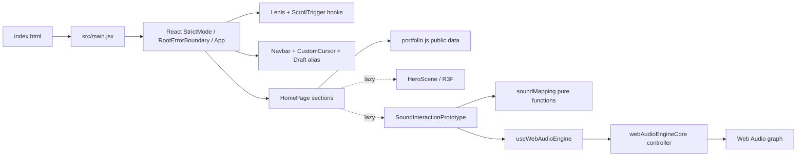

# 技術架構

## 技術清單

| 技術 | 實際用途 | 地位／影響 |
| --- | --- | --- |
| JavaScript ES modules + JSX | 全部應用、資料與自訂驗證腳本 | 核心；沒有 TypeScript |
| React 19 / React DOM | SPA 元件樹、hooks、lazy/Suspense、class error boundary | 核心 |
| Vite 8 | dev/build、模式 alias、Tailwind plugin、chunk 拆分 | 核心 |
| pnpm | lockfile 與全部 scripts | 核心 |
| Tailwind CSS v4 | JSX utility layout；Vite plugin 零 runtime | 核心 |
| 自訂 CSS tokens/primitives | 繁中排版、surface、sound pad、reduced-motion、print | 核心 |
| Motion for React | Hero CTA、卡片、custom cursor、reduced-motion | 核心 |
| GSAP + ScrollTrigger | Lenis ticker 與 gallery 主題反轉 | 核心 |
| Lenis | 平滑 wheel／anchor scroll | 核心；reduced-motion 停用 |
| Three.js + React Three Fiber | Hero shader orb 與粒子 | 選配、lazy 漸進增強 |
| Web Audio API | 旗艦案例合成聲音、pan/pitch/filter/gain | 核心產品證據；瀏覽器原生、無額外依賴 |
| Node test runner | `soundMapping.js` 純函式與 `webAudioEngineCore.js` lifecycle 測試 | 已使用；18 tests，不需 DOM 或真實聲卡 |
| Lighthouse | submission mobile／desktop lab audit、freshness 與 lineage summary | 開發工具；非 runtime |
| Python | 本機媒體產生腳本 | 開發工具 |

沒有 router、state library、form library、data-fetching layer、CMS、backend、database、auth、analytics、formatter 或正式 lint/type-check。自訂 audit／validator 是主要靜態品質門檻。

## 入口、渲染與資料流



`main.jsx` 註冊 ScrollTrigger，透過 `RootErrorBoundary` 將 `App` 掛到 `#root`。內容無 server render；元件直接 import `portfolio.js`，透過 props 傳給共用 renderer。沒有 context/store 或 network state。

## 頁面與元件責任

- [`../../src/App.jsx`](../../src/App.jsx)：頁面順序、旗艦／支持案例拆分、AI 方法、Reviewer Path 與頂層區段 error boundaries；`main` 首幀直接可見。
- [`../../src/components/Navbar.jsx`](../../src/components/Navbar.jsx)：桌面／行動 anchor 導覽、reduced-motion scroll、目標 heading focus、focus restore、hash 更新。
- [`../../src/components/ImmersiveHero.jsx`](../../src/components/ImmersiveHero.jsx)：資料驅動 Hero、首幀可讀標題／介紹、CTA Motion、延後 3D progressive loading。
- [`../../src/components/ResearchPositioning.jsx`](../../src/components/ResearchPositioning.jsx)：定位、軌道、術語轉譯與本所連結。
- [`../../src/components/CaseStudyShowcase.jsx`](../../src/components/CaseStudyShowcase.jsx)：索引、長篇案例、媒體、testing、credits、lazy flagship demo。
- [`../../src/components/SoundInteractionPrototype.jsx`](../../src/components/SoundInteractionPrototype.jsx)：具圖像語意的 pointer pad、touch／四個 range input、readout、節流 live announcement、聲音生命週期、mapping 說明。
- [`../../src/hooks/useWebAudioEngine.js`](../../src/hooks/useWebAudioEngine.js)：React state、StrictMode-safe controller lifecycle 與 `visibilitychange` 即時清理。
- [`../../src/audio/webAudioEngineCore.js`](../../src/audio/webAudioEngineCore.js)：可注入／可測試的 AudioContext controller，負責 resume cancel／timeout、graph、release、context interruption、參數與 destroy。
- [`../../src/audio/soundMapping.js`](../../src/audio/soundMapping.js)：可測試的 clamp、linear/log mapping 與參數安全範圍。
- [`../../src/components/LearningTrail.jsx`](../../src/components/LearningTrail.jsx)：學習中工具及證據邊界。
- [`../../src/components/AiWorkflowSection.jsx`](../../src/components/AiWorkflowSection.jsx)：生成式 AI／LLM 協作責任、Prompt 版本、失敗案例與文件證據入口。
- [`../../src/components/DataVisualizationSeries.jsx`](../../src/components/DataVisualizationSeries.jsx)：兩件資料作品的系列策展入口。
- [`../../src/components/SectionErrorBoundary.jsx`](../../src/components/SectionErrorBoundary.jsx)：區段失敗隔離與 reset。
- [`../../src/components/RootErrorBoundary.jsx`](../../src/components/RootErrorBoundary.jsx)：未捕捉 root error 的可閱讀 recovery 與重新載入操作。
- [`../../src/components/EditorialHeading.jsx`](../../src/components/EditorialHeading.jsx)：繁中片語分行與完整 accessible name。

## Web Audio 架構

```mermaid
flowchart LR
  A["Pointer / touch / range"] --> B["Normalized x, y, speed, size"]
  B --> C["soundMapping.js"]
  C --> D["Triangle Oscillator"]
  D --> E["Low-pass Filter"]
  E --> F["Voice Gain"]
  F --> G["Envelope"]
  G --> H["Stereo Panner"]
  H --> I["Compressor"]
  I --> J["Master Gain 0.62"]
  J --> K["Audio destination"]
```



- x 0→1 映射 pan -0.85→0.85。
- y 0→1 以對數映射 660→110 Hz，畫面上方較高音。
- pointer speed 0→1.2 px/ms 正規化後映射 filter 700→5000 Hz；鍵盤亦可透過第四個「濾波亮度」range 直接控制同一正規化參數。
- size 0→1 映射 voice gain 0.04→0.12；後方另有 compressor 和 master gain。
- 參數以 `setTargetAtTime` 平滑更新；音訊只在使用者按下「啟用聲音」後建立。
- Escape、離開 prototype viewport、頁面 hidden 或 unmount 會停止並關閉 context。
- 一般 stop 先執行 35 ms envelope release，再於 50 ms 關閉 graph；頁面 hidden、destroy、restart 與 context interruption 使用立即清理，避免 background timer throttling。
- 不支援 AudioContext／StereoPanner 或啟動失敗都有可讀錯誤訊息；`resume()` 超過 3 秒會關閉 pending context 並轉為 error，stop／destroy／較新 start 會立即取消 pending resume。
- controller 監聽 active context 的 suspended／interrupted／closed 狀態，避免 UI 停留在錯誤的 `running`。

[`../../tests/sound-mapping.test.mjs`](../../tests/sound-mapping.test.mjs) 有 5 個純 mapping tests；[`../../tests/web-audio-engine.test.mjs`](../../tests/web-audio-engine.test.mjs) 有 13 個 controller lifecycle tests，涵蓋支援偵測、建圖、參數、release、即時清理、reject／timeout／cancel、連續 start、context interruption、建圖失敗與 destroy。React UI 仍以 rendered smoke test 驗證；沒有 audible-output 自動測試。

## Draft／Submission 邊界

`VITE_PORTFOLIO_MODE=submission` 時，Vite alias `#portfolio-draft` 指向空元件；否則指向含治理 UI 的 draft module。`portfolio.js` 也以 build-time mode 排除 hidden immersive case。正式隔離不是 CSS 隱藏。`check:submission` 建置後掃描 forbidden terms，內容 validator 另外阻止 construction wording、敏感副檔名／local path、亂碼與 restricted public URLs。

## Styling 與 motion lifecycle

Tailwind utility 負責局部 grid/spacing；[`../../src/styles.css`](../../src/styles.css) 負責語意 tokens、繁中排版、mobile menu、surface、focus、sound pad、reduced-motion 與 print。`useLenisGsap` 讓 Lenis 與 GSAP 共用 ticker；`useThemeInversion` 以 `#gallery` 為 trigger 將深墨主題捲動轉成暖紙主題。Motion 與 R3F 各自讀取 reduced-motion 或裝置能力。

## 資產與 build pipeline

- `public/` 靜態資產原樣提供；案例圖使用 AVIF/WebP `srcset` 與固定 dimensions。
- R3F 與 Web Audio UI 都以 `React.lazy` 分 chunk；Three 不進 initial modulepreload。
- Vite manual chunks：`react`、`three`、`motion`、`scroll`、`vendor`。
- submission build 實測輸出包含約 13.45 kB 的 Sound prototype chunk 與 851.22 kB 的 Three chunk；後者觸發 Vite >500 kB warning，但為延遲載入。
- `run-lighthouse.mjs` 明確建置 submission／相對 base並先跑 submission／Pages scan；以完整 path／size／SHA-256 manifest 複製 immutable artifact，再由動態 port preview。它動態納入根目錄 Vite `.env*`，在 audit 前後核對 build-input path set／manifest，並驗證 mtime、fetchTime、URL、完整 resolved mobile／desktop config、runtime、categories、metrics 與 diagnostics；profile fingerprint 保存完整設定，environment／comparability fingerprint 另納入 benchmark、OS 與穩定 CPU identity，繼承環境只保存名稱與值雜湊。
- 每次 Lighthouse run 從 build 前至發布完成持有跨程序獨占鎖，只有 metadata 完整且 PID 回報 `ESRCH` 的 stale lock 可用 token quarantine 回收。唯一 archive 先寫入 raw reports、conditions、CLI stdout／stderr transcript、artifact／source manifests 與完整受測 `dist`，重驗所有雜湊後最後原子建立 `archive-complete.json`；沒有 marker 的孤兒目錄不算成功。canonical reports／history 以 sibling temp＋rename 更新並可整組 rollback，latest summary 最後 atomic replace 作權威指標；失敗 run 保留上一份成功 summary。最近 20 次索引在 `reports/lighthouse-history.json`。只有 fresh report 通過全部驗證，且非零輸出精確指向該 run Chrome temp 的已知 cleanup `EPERM` 簽章時才降為具名 warning並封存原始輸出。
- `restricted-media/` 在 `public/` 外，不會被 Vite 複製。
- 外部 runtime 只有資料案例的 YouTube privacy-enhanced iframe；沒有 fetch/API。

## 環境、部署與失敗邊界

- 唯一應用 mode 值是 `VITE_PORTFOLIO_MODE`; 非 `submission` 一律視為 draft。
- PowerShell wrappers 優先使用 PATH Node，否則回退 Codex bundled Node，顯示主要開發環境為 Windows／PowerShell。
- Vite 預設使用相對 `base`，也可由 `VITE_BASE_PATH` 覆寫；public assets 以 `BASE_URL` 組路徑。因沒有 client routes，不需要 SPA rewrite 或 404 route。
- `check:submission` 會再跑 `audit:pages`，拒絕 build 輸出中的 GitHub Pages-breaking root-relative assets。
- `.github/workflows/deploy-pages.yml` 是 manual-only：Windows build job 使用 Node 22／pnpm 11.7 驗證 submission，再交給 Pages deploy job。尚未 push、遠端執行或 production deploy，也沒有 domain。
- Hero、旗艦、支持案例及聲音 demo 有 section error boundaries；React 根另有共同 recovery boundary。

## 開發與驗證命令

```powershell
pnpm install
pnpm run workspace:check
pnpm run audit:media
pnpm run audit:text
pnpm run audit:cjk
pnpm run content:check
pnpm run test:sound
pnpm run build:draft
pnpm run check:submission
pnpm run doctor
```

開發：`pnpm run dev:draft`；正式內容預覽：`pnpm run dev:submission`。需要效能證據時才執行 `pnpm run audit:lighthouse`；它產生 fresh mobile／desktop JSON 與 `reports/lighthouse-summary.json`，仍應把 localhost lab 與 production field evidence 分開解讀。
