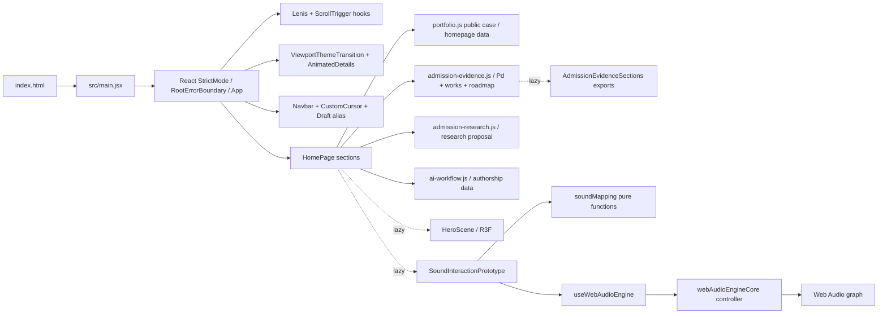

# 技術架構

## 2026-07-26 Hamlet publication architecture

- `hamlet-media-manifest.json` schema v2 將 artifact evidence 與 `rightsEvidence` registry 分開；四個 rights items 只驗證列入常數表的具名 `requiredChecks`，conditions 中合法的 false 不會被 generic boolean heuristic 誤判。
- `scripts/validate-hamlet-rights.mjs` 是純函式；`audit-portfolio-evidence.mjs` 傳入 manifest、公開 source、`git ls-files` 與 dist inventory。結構／固定事實在一般 audit fail closed，applicant readiness 只在 publication mode 阻擋。
- Node tests 覆蓋 valid manifest、attestation false、unknown ref、Suno hash、commercial true、missing attribution、scene check、Canva check、literary check、tracked／built EML、指定確認人、evidence lifecycle，以及 disclosure renderer 接線。
- Submission scanner 新增 `.eml` 與 private-rights-evidence inventory rules；`.gitignore` 另阻擋 private directories、EML 與 original authorization／support reply filenames。Ignore 規則不被解讀為 history cleanup。
- Pages build 順序固定為 install → `check:submission` → `check:publication` → configure → upload；workspace check 驗證順序並拒絕 `continue-on-error: true`。
- Phase A 的 applicant attestation 為 false，publication gate 實測 exit 1／25 blockers；其餘指定命令均 exit 0。這個部署阻擋不影響 11 段 IA、motion、Web Audio 或 `notValidated` 的研究邊界。
- Browser runtime 以 production-like submission preview 驗證四個 viewport；影片 metadata duration 40 秒、controls true、autoplay false、keyboard play／pause 成功，2 tracks、8 storyboard images、Suno focus-visible link 與 pending panel 正常，duplicate IDs／global overflow／console logs 均為 0。

## 2026-07-24 最新共享工作樹（待最終驗證）

- `HomePage` 目前以 11 個主要閱讀段落組合：Hero、`SoundTransitionSection`、`ReviewerPathSection`、旗艦 `CaseStudyShowcase`、`PureDataLearningSection`、`ResearchProposalSection`、代表作品／支持案例群、`CollaborationSection`、`LearningRoadmapSection`、`AiWorkflowSection`、`ContactSection`。資料視覺化系列與支持案例索引屬代表作品群的延伸，不另計為主段落。
- 新增 [`../../src/data/admission-evidence.js`](../../src/data/admission-evidence.js) 與 [`../../src/components/AdmissionEvidenceSections.jsx`](../../src/components/AdmissionEvidenceSections.jsx)。單一 dynamic import 被拆成 Pure Data、代表作品、合作、學習路線與聯絡五個 lazy exports；`DeferredAdmissionSection` 提供永久 anchor wrapper、Suspense、section error boundary 及 deferred-ready fragment 重新校正。
- Pure Data v0.2.1 影片與 poster 已在 `public/media/portfolio/` 並由 `<video controls playsInline preload="metadata">` 實際引用；資料層記錄 1276×720、62.983 秒、H.264／AAC及文字觀看指南。影片播放失敗只切換文字 fallback，證據與限制內容不會消失。
- 研究構想由 `admission-research.js` 的 `layers` 陣列驅動，四層固定為問題、初步構想、申請者可帶入的能力、入學後需補強；`ResearchProposalSection` 另渲染五步預定流程、預期貢獻與 disclaimer。`#research-positioning` 是永久 wrapper，內含相容舊連結的 `#research-proposal` alias。
- 公開邊界依檔案位置而非渲染狀態判定：Pd 影片／poster 在 `public/`，會被 Vite 原樣複製；畫面中的本機 D 槽路徑與 `validated` 字樣因此仍屬公開 binary 內容。`.pd`、完整研究計畫、REAPER 工程及兩件代表作品成片不在公開 repository；但未來 commit／push 的 admission source 與 docs 仍會在 public GitHub Repository 可讀。
- 最新整合沒有新增 dependency，也沒有移除 R3F、Motion、GSAP／Lenis、Custom Cursor、Web Audio lifecycle、reduced-motion 或既有 submission alias。
- 最終自動驗證：`pnpm run doctor` exit 0；draft build 470 modules、submission build 467 modules；fresh `dist/` 為 132 files／25 text files；`public/` 118 files 全數進入 `dist/`，0 missing／0 SHA-256 mismatch。Submission scanner 使用 54 個 text rules 與 7 個 inventory rules，regression fixtures 為 57/57。
- `pnpm run check:publication` exit 1，阻擋項仍是 11 個 Hamlet 權利／applicant attestation blockers；這是預期且不可繞過的發布門檻。
- 互動式 in-app Browser 已嘗試，但因本機連線隔離，即使 shell 對本機預覽取得 HTTP 200，Browser 仍無法連線。四個 viewport、導覽／焦點、Web Audio、Pure Data 影片播放、reduced-motion、overflow 與 console 檢查因此均未能執行，不得記為通過。

## 2026-07-24 Admission Evidence Pass（整合前歷史快照）

- 當時曾進行研究構想拆分與 lazy section 實驗；其元件責任與 IA 已由上方最新 `SoundTransitionSection`／`ReviewerPathSection`、四層 `ResearchProposalSection` 及 AdmissionEvidence 架構取代。
- 公開資料 validator 新增申請狀態、Web Audio 9 階段 signal flow、研究構想、Pure Data／REAPER 邊界、AI 三組責任與完整失敗鏈契約；submission scanner 新增內部送審詞與成效／系統完成過度主張 fixtures。
- 這些變更沒有新增 dependency，也沒有移除 R3F、Motion、GSAP／Lenis、Custom Cursor、Web Audio lifecycle 或 reduced-motion fallback。
- Submission alias 只隔離 bundle。Public Git Repository 中已 tracked 的 hidden／internal／prompt 文件仍可讀；本輪新增 `docs/admission/*` 目前只在本機，若日後 commit／push 到 public Repository 也會公開。
- 當時 `pnpm run doctor` exit 0；舊 module、bundle 與 chunk 數字已被上方 470／467 modules 的最新結果取代。

## 2026-07-23 技術快照

- PR #5 已 merged；目前工作分支 `codex/public-copy-rewrite` 的 `61ea9d8` 與 `main`／`origin/main` 的 `695b520` 雖有不同歷史，tree 內容相同。
- 這一輪公開文案調整只改寫繁體中文敘事、導覽／介面標籤與 metadata，沒有改動 runtime 行為、元件架構、動效、樣式、資產管線或 dependencies。
- 最新 Pages run `29680534295` 已成功部署 `695b520`。公開首頁可讀到新版文案，首頁、Hamlet MP4、英文與繁中 VTT、poster 於 2026-07-23 實測皆為 HTTP 200；可達性不代表素材權利已獲核准。
- 2026-07-23 `pnpm run doctor` exit 0。Fresh draft build 為 initial JS 199833 gzip B、entry 181592 B、CSS 43688 B；fresh submission build 為 initial JS 193737 gzip B、entry 160908 B、CSS 43688 B；lazy 3D closure 仍為 638680 raw／169383 gzip B。
- `pnpm run check:publication` 仍為預期的 exit 1，共 11 個權利／attestation blockers。部署 workflow 尚未執行這個 gate，因此技術部署成功不能解讀為 publication clearance。

## 技術清單

| 技術 | 實際用途 | 地位／影響 |
| --- | --- | --- |
| JavaScript ES modules + JSX | 全部應用、資料與自訂驗證腳本 | 核心；沒有 TypeScript |
| React 19 / React DOM 19（目前安裝 19.2.7） | SPA 元件樹、hooks、lazy/Suspense、class error boundary | 核心 |
| Vite 8.1.x（目前安裝 8.1.3） | dev/build、模式 alias、Tailwind plugin、chunk 拆分 | 核心 |
| pnpm 11.7 package contract | lockfile 與全部 scripts；本機實際 CLI 可更高但 lock/packageManager 以 11.7 為可重現基準 | 核心 |
| Tailwind CSS 4.3（目前安裝 4.3.2） | JSX utility layout；Vite plugin 零 runtime | 核心 |
| 自訂 CSS tokens/primitives | 繁中排版、surface、sound pad、reduced-motion、print | 核心 |
| Motion for React 12（目前安裝 12.42.2） | Hero CTA、卡片、custom cursor、reduced-motion | 核心 |
| GSAP package contract `^3.13.0`（目前安裝 3.15.0）+ ScrollTrigger | Lenis ticker、固定 viewport 場域 scroll scrub 與 fixed-nav chrome threshold | 核心；未使用付費 plugin |
| Lenis 1.3（目前安裝 1.3.25） | 平滑 wheel／anchor scroll | 核心；reduced-motion 停用 |
| Three.js 0.179.1 + React Three Fiber 9.6.1 | Hero shader orb 與粒子 | 選配、lazy 漸進增強 |
| Web Audio API | 旗艦案例合成聲音、pan/pitch/filter/gain | 核心產品證據；瀏覽器原生、無額外依賴 |
| Node test runner | `soundMapping.js` 純函式與 `webAudioEngineCore.js` lifecycle 測試 | 已使用；18 tests，不需 DOM 或真實聲卡 |
| Submission scanner core | 54 個 text rules、7 個 binary／path inventory rules、redacted diagnostics 與 57 個 isolated CLI fixtures | 已使用；不需網路，可對 fresh `dist/` fail closed |
| Lighthouse 13.4 | submission mobile／desktop lab audit、freshness 與 lineage summary | 開發工具；非 runtime |
| Python | 本機媒體產生腳本 | 開發工具 |

沒有 router、state library、form library、data-fetching layer、CMS、backend、database、auth、analytics、formatter 或正式 lint/type-check。自訂 audit／validator 是主要靜態品質門檻。

## 入口、渲染與資料流


```mermaid
flowchart LR
  A["index.html"] --> B["src/main.jsx"]
  B --> C["React StrictMode / RootErrorBoundary / App"]
  C --> D["Lenis + ScrollTrigger hooks"]
  C --> N["ViewportThemeTransition + AnimatedDetails"]
  C --> E["Navbar + CustomCursor + Draft alias"]
  C --> F["HomePage sections"]
  F --> G["portfolio.js public case / homepage data"]
  F --> O["admission-evidence.js / Pd + works + roadmap"]
  F --> P["admission-research.js / research proposal"]
  F --> Q["ai-workflow.js / authorship data"]
  O -. lazy .-> R["AdmissionEvidenceSections exports"]
  F -. lazy .-> H["HeroScene / R3F"]
  F -. lazy .-> I["SoundInteractionPrototype"]
  I --> J["soundMapping pure functions"]
  I --> K["useWebAudioEngine"]
  K --> L["webAudioEngineCore controller"]
  L --> M["Web Audio graph"]
```

`main.jsx` 註冊 ScrollTrigger，透過 `RootErrorBoundary` 將 `App` 掛到 `#root`。內容無 server render；案例與首頁敘事由 `portfolio.js` 提供，Pure Data／代表作品／合作／學習路線／公開連結由 `admission-evidence.js` 提供，研究構想與 AI／作者性分別由 `admission-research.js`、`ai-workflow.js` 提供。沒有 context/store 或 network state。

## 頁面與元件責任

- [`../../src/App.jsx`](../../src/App.jsx)：11 段主 IA、旗艦／支持案例拆分、五個 admission evidence lazy exports、AI 方法、頁尾公開連結、固定 viewport transition mount 與頂層區段 error boundaries；`main` 首幀直接可見；初始 deep link 會為目標長案例解除 placeholder layout、重算既有 Lenis range，再進行一次性定位。
- [`../../src/components/ViewportThemeTransition.jsx`](../../src/components/ViewportThemeTransition.jsx)：`aria-hidden`、pointer-inert 的固定 viewport layer；只提供 paper、mist 與 3 個 radial field DOM，沒有獨立 loop 或內容 blur。
- [`../../src/components/AnimatedDetails.jsx`](../../src/components/AnimatedDetails.jsx)：共用 native `<details>/<summary>` disclosure；以 Web Animations API 動畫實際高度，處理兩向、快速反轉、鍵盤與 reduced-motion，完成後發出 `portfolio:layout-change`。
- [`../../src/components/Navbar.jsx`](../../src/components/Navbar.jsx)：桌面／行動 anchor 導覽、reduced-motion scroll、一般目標 heading focus、lazy 區段永久 wrapper focus、focus restore、hash 更新；行動選單以 Motion 動畫 height／opacity，nav 表面不再使用固定 backdrop blur。
- [`../../src/components/ImmersiveHero.jsx`](../../src/components/ImmersiveHero.jsx)：資料驅動 Hero、首幀可讀標題／介紹、CTA Motion、延後 3D progressive loading。
- [`../../src/components/LeanR3FCanvas.jsx`](../../src/components/LeanR3FCanvas.jsx)：以 R3F public `createRoot`／`events` 建立 Hero 專用 canvas，只註冊實際使用的 8 個 Three constructors；同步尺寸、DPR 與 frameloop，並以可取消 disposal 避免 StrictMode replay 的舊清理銷毀新 root。
- [`../../src/components/ResearchPositioning.jsx`](../../src/components/ResearchPositioning.jsx)：預設輸出 `SoundTransitionSection`，具名匯出 `ReviewerPathSection`；前者呈現轉向聲音的三步問題意識，後者提供六條證據閱讀路徑。此檔目前沒有 `ResearchEvidenceContext`。
- [`../../src/components/ResearchProposalSection.jsx`](../../src/components/ResearchProposalSection.jsx)：呈現問題、初步構想、申請者可帶入能力、入學後需補強四層研究定位，以及五步預定流程、預期貢獻與不可省略的申請階段聲明。
- [`../../src/components/AdmissionEvidenceSections.jsx`](../../src/components/AdmissionEvidenceSections.jsx)：輸出 Pure Data 學習紀錄、代表作品、專案與合作、四階段學習路線及研究方向／連結；Pure Data `<video>` 具 poster、metadata preload、文字觀看指南與失敗 fallback。
- [`../../src/components/CaseStudyShowcase.jsx`](../../src/components/CaseStudyShowcase.jsx)：索引、長篇案例、16:9／多字幕影片、媒體／字幕錯誤 fallback、具輸入與人工檢查的 workflow、Prompt 決策、storyboard、媒體分層、證據分類、testing、credits 與 lazy flagship demo；Prompt Template、圖解長描述與雙語逐字稿使用共用 `AnimatedDetails`，支持作品沿用局部暖紙 tokens，案例本所連結分開 demonstrated 與 research direction。
- [`../../src/components/SoundInteractionPrototype.jsx`](../../src/components/SoundInteractionPrototype.jsx)：具圖像語意的 pointer pad、touch／四個 range input、readout、節流 live announcement、聲音生命週期、mapping 說明。
- [`../../src/hooks/useWebAudioEngine.js`](../../src/hooks/useWebAudioEngine.js)：React state、StrictMode-safe controller lifecycle 與 `visibilitychange` 即時清理。
- [`../../src/audio/webAudioEngineCore.js`](../../src/audio/webAudioEngineCore.js)：可注入／可測試的 AudioContext controller，負責 resume cancel／timeout、graph、release、context interruption、參數與 destroy。
- [`../../src/audio/soundMapping.js`](../../src/audio/soundMapping.js)：可測試的 clamp、linear/log mapping 與參數安全範圍。
- [`../../src/components/LearningTrail.jsx`](../../src/components/LearningTrail.jsx)：舊元件仍在 source，但不在目前 `App.jsx` 主 IA；現行學習狀態由 `AdmissionEvidenceSections` 的 `LearningRoadmapSection` 呈現。
- [`../../src/components/AiWorkflowSection.jsx`](../../src/components/AiWorkflowSection.jsx)：生成式 AI／LLM 協作責任、Prompt 版本、失敗案例與文件證據入口。
- [`../../src/components/DataVisualizationSeries.jsx`](../../src/components/DataVisualizationSeries.jsx)：兩件資料作品的系列策展入口。
- [`../../src/components/SectionErrorBoundary.jsx`](../../src/components/SectionErrorBoundary.jsx)：區段失敗隔離與 reset。
- [`../../src/components/RootErrorBoundary.jsx`](../../src/components/RootErrorBoundary.jsx)：未捕捉 root error 的可閱讀 recovery 與重新載入操作。
- [`../../src/components/EditorialHeading.jsx`](../../src/components/EditorialHeading.jsx)：繁中片語分行與完整 accessible name。

## Web Audio 架構


```mermaid
flowchart LR
  A["Pointer / touch / range"] --> B["Normalized x, y, speed, size"]
  B --> C["soundMapping.js"]
  C --> D["Triangle Oscillator"]
  D --> E["Low-pass Filter"]
  E --> F["Voice Gain"]
  F --> G["Envelope"]
  G --> H["Stereo Panner"]
  H --> I["Compressor"]
  I --> J["Master Gain 0.62"]
  J --> K["Audio destination"]
```

- x 0→1 映射 pan -0.85→0.85。
- y 0→1 以對數映射 660→110 Hz，畫面上方較高音。
- pointer speed 0→1.2 px/ms 正規化後映射 filter 700→5000 Hz；鍵盤亦可透過第四個「濾波亮度」range 直接控制同一正規化參數。
- size 0→1 映射 voice gain 0.04→0.12；後方另有 compressor 和 master gain。
- 參數以 `setTargetAtTime` 平滑更新；音訊只在使用者按下「啟用聲音」後建立。
- Escape、離開 prototype viewport、頁面 hidden 或 unmount 會停止並關閉 context。
- 一般 stop 先執行 35 ms envelope release，再於 50 ms 關閉 graph；頁面 hidden、destroy、restart 與 context interruption 使用立即清理，避免 background timer throttling。
- 不支援 AudioContext／StereoPanner 或啟動失敗都有可讀錯誤訊息；`resume()` 超過 3 秒會關閉 pending context 並轉為 error，stop／destroy／較新 start 會立即取消 pending resume。
- controller 監聽 active context 的 suspended／interrupted／closed 狀態，避免 UI 停留在錯誤的 `running`。

[`../../tests/sound-mapping.test.mjs`](../../tests/sound-mapping.test.mjs) 有 5 個純 mapping tests；[`../../tests/web-audio-engine.test.mjs`](../../tests/web-audio-engine.test.mjs) 有 13 個 controller lifecycle tests，涵蓋支援偵測、建圖、參數、release、即時清理、reject／timeout／cancel、連續 start、context interruption、建圖失敗與 destroy。React UI 仍以 rendered smoke test 驗證；沒有 audible-output 自動測試。

## Draft／Submission 邊界

`VITE_PORTFOLIO_MODE=submission` 時，Vite alias `#portfolio-draft` 指向空元件，`#portfolio-hidden` 指向空資料模組；draft mode 則分別解析治理 UI 與 `portfolio.hidden.js`。編輯用 `portfolioPriorityRules` 也只位於 `portfolio.internal.js`，不由公開 `portfolio.js` 匯出。這些是 build/dev module boundaries，不依賴 CSS 隱藏。

每個 authored case 的每個 `instituteConnections` 主題都需要 `themeEvidenceStatus`：`demonstrated` 代表已有作品證據，`researchDirection` 代表未來研究方向；submission-hidden 研究構想也不得省略分類。`instituteEvidenceGroups` 只會對 `submissionVisibility === "public"` 案例依優先序及 demonstrated 關係正確派生；validator 重建期望結構後做完整相等比對，並拒絕未知狀態、非公開案例或對不上 rationale 的關係。因此目前公開摘要不會產生「沉浸式體驗」或「數位孿生」群組，它們只在案例內以 research direction 呈現。

Hidden case 使用空 media state；原有 13 個 `ph-after-*`／`mv-soft-*` placeholders、generator entries、captions 與 references 已移除。Submission dev 另保留 Vite 預設 deny，並封鎖 `.tmp`、`dist`、`reports`、`restricted-media`、internal／hidden modules 等根目錄直連；submission-only middleware 讓缺少的 `/media/portfolio/*` 與所有 `/dist/*` dev URL 明確回 404，而不是落入 SPA HTML fallback，有效 public media 仍照常服務。`submission-output-scanner.mjs` 對 HTML／JS／CSS／JSON／source map／TXT／SVG／VTT／Web Manifest／XML 套用 54 個 text rules，並對所有相對路徑套用 7 個 inventory rules；binary 不作 UTF-8 掃描。57 個 isolated CLI fixtures 驗證 bad output exit 1、clean／明確否定 caveat exit 0、separator／case normalization、新增文字格式、已知編輯規則、中文佔位語句、過度成果主張與 redacted diagnostics。

## Styling 與 motion lifecycle

Tailwind utility 負責局部 grid/spacing；[`../../src/styles.css`](../../src/styles.css) 負責語意 tokens、繁中排版、mobile menu、surface、focus、sound pad、disclosure、fixed viewport field、reduced-motion 與 print。Document root 與 foreground tokens 保持穩定；`.paper-surface` 將暖紙 tokens 用於支持作品 gallery、研究構想、補充研究脈絡、AI／作者性與頁尾快速導覽。`useLenisGsap` 讓 Lenis 與 GSAP 共用 ticker，並在 `portfolio:layout-change` 時以 rAF 合併 Lenis resize 與 ScrollTrigger refresh。`useThemeInversion` 以 `#data-visualization-series` bottom 70% 與 `#project-index-title` top 25% 計算自然邊界，再把 range clamp 為 0.8–1.2 viewport；`scrub:true`／`invalidateOnRefresh:true` 只動畫固定 field 子層的 opacity／transform，`.nav-surface--paper` 依同一 progress 切換，不再修改 document root。

Navbar 改用較不透明的 theme-aware 背景，不再使用固定 `backdrop-blur-2xl`。Hero canvas 與 magnetic targets 都不保留永久 `will-change`；案例圖片／影片只在 fine-pointer hover 或 focus-within 時暫時晉升。Reduced motion 將 fixed field 改為同一邊界的離散 dark／paper endpoint，AnimatedDetails 與行動選單立即開關；print 隱藏 field、展開 disclosure，並將主要 section 強制為 paper-safe 背景。

動效延續以 [`../../AGENTS.md`](../../AGENTS.md) 的 preservation contract 為架構約束：Hero line-mask、fixed viewport theme field 與深層連結 settle 屬 narrative guidance；menu、disclosure、card、sound feedback 與 active navigation 屬 interaction feedback；R3F、custom cursor 與色場屬 atmosphere／authorship。這三類預設保留。若效能有疑慮，先縮小 paint area、改用 transform／opacity、延後或降低啟用頻率、提供 mobile／low-power／reduced-motion 回退；只有 profiling 證明實質問題時才移除，並在 handoff 記錄證據與替代互動。

## 資產與 build pipeline

- `public/` 靜態資產原樣提供；案例圖使用 AVIF/WebP `srcset` 與固定 dimensions。Hamlet 交付版 MP4 使用外掛英文／繁中 WebVTT，renderer 不自動播放並以同頁逐字稿補足；根目錄 `.gitattributes` 強制 `*.vtt` 使用 LF，讓 Windows checkout 仍維持 manifest 已驗證的 bytes／SHA-256。任何放入 public 的檔案都應視為可公開，即使 submission React tree 沒有引用；技術完整性與 HTTP 可達性都不能取代 rights clearance。
- Pure Data 操作 MP4 與 PNG poster 也位於 `public/media/portfolio/`；fresh submission audit 比對全部 118 個 `public/` files，結果為 0 missing／0 SHA-256 mismatch。這只證明複製完整，不會清除媒體畫面中的本機路徑或 `validated` 字樣。
- R3F 與 Web Audio UI 都以 `React.lazy` 分 chunk；Three 不進 initial modulepreload。Hero section 作為 R3F `eventSource`，pointer 以 section 的 `clientX/Y` 換算；離開 preload window 後改為 `frameloop="demand"`。
- Vite manual chunks：`react`、`three-core`、`motion`、`scroll`、`vendor`；R3F 自然留在 lazy `HeroScene`，避免強制打包整個 Three namespace。
- 2026-07-23 fresh build 中，lazy 3D closure 合計 638680 raw／169383 gzip B；draft initial JS closure 為 199833 gzip B、entry 181592 B、CSS 43688 B，submission initial JS closure 為 193737 gzip B、entry 160908 B、CSS 43688 B。`audit-build-budgets.mjs` 以 attribute-order-independent HTML 解析和 built import closure 計算 initial／lazy 成本，並逐檔限制 500000 raw B，因此沒有 >500 kB warning。
- 2026-07-24 最終自動驗證的 draft／submission module 數分別為 470／467；fresh submission `dist/` 為 132 files／25 text files。先前 2026-07-23 bundle 數字只保留為歷史效能快照。
- `audit-portfolio-evidence.mjs` 核對 Hamlet direct-copy bytes／SHA-256、衍生 AVIF/WebP inventory SHA-256、實際 dimensions、VTT timing／逐字稿及 public inventory。Publication mode 另外要求頂層核准狀態、逐項 rights checks／evidence refs 與完整 applicant attestation；只改一個 status 不能解除 gate。
- `run-lighthouse.mjs` 明確建置 submission／相對 base並先跑 submission／Pages scan；以完整 path／size／SHA-256 manifest 複製 immutable artifact，再由動態 port preview。它動態納入根目錄 Vite `.env*`，在 audit 前後核對 build-input path set／manifest，並驗證 mtime、fetchTime、URL、完整 resolved mobile／desktop config、runtime、categories、metrics 與 diagnostics；profile fingerprint 保存完整設定，environment／comparability fingerprint 另納入 benchmark、OS 與穩定 CPU identity，繼承環境只保存名稱與值雜湊。
- 每次 Lighthouse run 從 build 前至發布完成持有跨程序獨占鎖，只有 metadata 完整且 PID 回報 `ESRCH` 的 stale lock 可用 token quarantine 回收。唯一 archive 先寫入 raw reports、conditions、CLI stdout／stderr transcript、artifact／source manifests 與完整受測 `dist`，重驗所有雜湊後最後原子建立 `archive-complete.json`；沒有 marker 的孤兒目錄不算成功。canonical reports／history 以 sibling temp＋rename 更新並可整組 rollback，latest summary 最後 atomic replace 作權威指標；失敗 run 保留上一份成功 summary。最近 20 次索引在 `reports/lighthouse-history.json`。只有 fresh report 通過全部驗證，且非零輸出精確指向該 run Chrome temp 的已知 cleanup `EPERM` 簽章時才降為具名 warning並封存原始輸出。
- 歷史 Lighthouse archive `2026-07-17T10-53-04-160Z`：mobile Performance 94／Accessibility 100／LCP 2632 ms／TBT 56 ms／transfer 459090 B；desktop 100／100／548 ms／0 ms／442761 B；兩者 CLS 0。這是文案改寫前 source fingerprint 的 localhost simulated lab；2026-07-19 後 content／metadata fingerprint 已漂移，不得再稱為 current-fingerprint，也不是 production field evidence。
- `restricted-media/` 在 `public/` 外，不會被 Vite 複製；submission dev 也以 filesystem deny 阻擋直接 URL。
- 外部 runtime 只有資料案例的 YouTube privacy-enhanced iframe；沒有 fetch/API。
- `index.html`、canonical URL、JSON-LD、`public/llms.txt`、favicon、social preview 與案例 SEO title 已完成並同步新版繁體中文定位；目前頁面標題為「蕭智仁｜聲響、互動與數位學習作品集」。Metadata／canonical 不再列為待決缺口。

## 環境、部署與失敗邊界

- 唯一應用 mode 值是 `VITE_PORTFOLIO_MODE`; 非 `submission` 一律視為 draft。
- PowerShell wrappers 優先使用 PATH Node，否則回退 Codex bundled Node，顯示主要開發環境為 Windows／PowerShell。
- Vite 預設使用相對 `base`，也可由 `VITE_BASE_PATH` 覆寫；public assets 以 `BASE_URL` 組路徑。應用沒有 client routes，因此不需要獨立 application 404 頁；submission dev 仍針對媒體／`dist` 邊界阻止 Vite 的通用 SPA fallback。
- `check:submission` 先跑 scanner regression suite，再 build、掃描 text／inventory，最後執行 `audit:pages` 拒絕 GitHub Pages-breaking root-relative assets。
- `.github/workflows/deploy-pages.yml` 會在 push 到 `main` 或 `workflow_dispatch` 時執行：Windows build job 使用 Node 22／pnpm 11.7 驗證 submission，再交給 Pages deploy job。PR #5 merge commit `695b520` 的最新遠端 run `29680534295` 與 deployment 已成功，environment URL 為 `https://ruyuang0509.github.io/ruyuang-portfolio/` 且 production 實測 HTTP 200；repository 沒有 `CNAME`。本輪未能從未認證 Pages-site endpoint 重新取得 `built` 欄位。
- 部署 job 目前執行 `check:submission`，沒有執行 `check:publication`。2026-07-23 後者仍因 11 個 Hamlet rights／applicant attestation blockers 而 exit 1，但 MP4、英文與繁中 VTT、poster 已在 Pages 回應 HTTP 200。這是 deployment architecture 的 P0 policy gap，不得把 workflow success 或媒體可達性解讀為 rights clearance。
- Hero、旗艦、支持案例及聲音 demo 有 section error boundaries；React 根另有共同 recovery boundary。

## 開發與驗證命令

```powershell
pnpm install
pnpm run workspace:check
pnpm run audit:media
pnpm run audit:text
pnpm run audit:cjk
pnpm run audit:evidence
pnpm run content:check
pnpm run test:sound
pnpm run test:submission-scanner
pnpm run build:draft
pnpm run check:submission
pnpm run doctor
```

開發：`pnpm run dev:draft`；正式內容預覽：`pnpm run dev:submission`。需要效能證據時才執行 `pnpm run audit:lighthouse`；它產生 fresh mobile／desktop JSON 與 `reports/lighthouse-summary.json`，仍應把 localhost lab 與 production field evidence 分開解讀。現存 2026-07-17 Lighthouse archive 已因後續內容／metadata 改動成為歷史樣本。2026-07-24 `doctor` exit 0；`check:publication` exit 1，原因精確為 11 個 Hamlet 權利／applicant attestation blockers。

正式提交驗證需在 `check:submission` 之後再做獨立檢查：

1. 搜尋 built JS／HTML／TXT／SVG 中的「施工模式」、舊品牌與失效 anchors。
2. 盤點 `dist/media/portfolio`，確認 hidden-only 檔名不存在。
3. 比對 `public/llms.txt`、favicon、robots、social preview 與 `index.html` 的品牌／URL。
4. 確認 `restricted-media` 檔名、local path、原始資料副檔名與敏感素材沒有進入 `dist/`。
5. 只有在 current source fingerprint 與 audited artifact 對得上時，才引用 Lighthouse 分數。

## Development continuation guide

### 每輪開始

1. 確認 `git rev-parse --show-toplevel` 指向 canonical root。
2. 檢查 branch／remote／dirty state；截至 2026-07-23，`codex/public-copy-rewrite`／`61ea9d8` 與 `main`／`695b520` tree 相同且 PR #5 已 merged。下一輪實作應由最新 `main` 建立使用者指定的新 `codex/` branch，不沿用已合併 PR。
3. 先讀本索引、`CODEX_HANDOFF.md`、`PORTFOLIO_AUDIT.md`、`CONTENT_MATRIX.md` 與本次要改動領域的 guardrail 文件。
4. 執行 `pnpm run workspace:check`，再依改動範圍選擇 content、sound、build、submission 或 Lighthouse 驗證。

### 重要目錄與安全延伸點

| 位置 | 責任／延伸規則 |
| --- | --- |
| `src/data/portfolio.js` | 公開敘事、案例順序、測試狀態、`themeEvidenceStatus` 與公開 media metadata；不可放施工待辦或編輯選件規則 |
| `src/data/portfolio.hidden.js` | Draft-only hidden case 文字；保持空 media state，submission alias 解析為空模組 |
| `src/data/portfolio.internal.js` | Draft-only 施工／風險備註與 `portfolioPriorityRules`；submission UI 由 alias 整層移除 |
| `src/components/CaseStudyShowcase.jsx` | 共用案例 renderer；新增欄位前先更新 authoring schema／validator |
| `src/audio/` | Mapping pure functions 與可測 controller；新 mapping 應先維持安全輸出範圍並補 Node tests |
| `src/styles.css` | 語意 tokens、繁中排版、theme、scrollbar、reduced-motion、print；改色彩／字級前讀 visual guardrails |
| `public/` | 所有檔案都會公開複製；只放正式可發布資產與 metadata |
| `restricted-media/` | 不可公開原始資料；不得由 component、public URL 或 build script 引用 |
| `scripts/` | Windows／Codex validation wrappers 與 audits；scanner 改動需要以已知漏網案例做 regression |

### Fragile areas

- Hidden data、internal UI／notes、public assets 與 dev root serving 是不同邊界，修一層不能假設另外幾層安全。
- Web Audio 必須維持 user gesture、pending cancel、stop／destroy、hidden cleanup、unsupported／timeout fallback。
- Hero DOM 文字必須保持首幀 LCP；Three 不可重新進 initial modulepreload 或在 Save-Data／reduced-motion 強制載入。
- Navbar 的滑鼠、桌面鍵盤、行動 focus restore 與 hash 更新是不同路徑，改導覽時要分別回歸。
- Power BI 原圖、測試結果、聯絡資料、研究成果與 credits 都需要 stakeholder 證據，不能由工程端推測補齊。

### 建議續作順序

Submission hygiene、57／7 scanner 規則、metadata 與 canonical 已完成本機 closure，2026-07-24 `doctor` 亦通過。下一步應先處理 Hamlet rights／attestation gate，再補 REAPER、Pure Data 獨立重建與人工 accessibility／device matrix。互動式 Browser 因本機連線隔離未能執行；即使 shell HTTP 200，也不能把四 viewport、導覽／焦點、Web Audio、影片播放、reduced-motion、overflow 或 console 標為已驗證。
